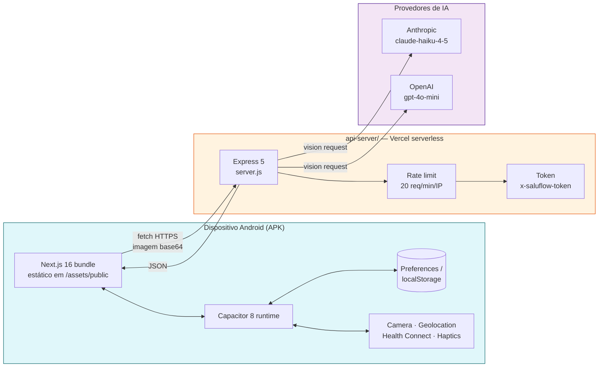
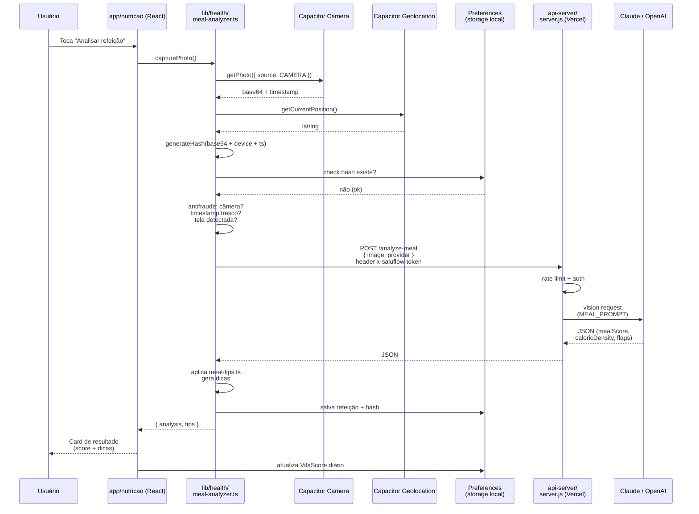
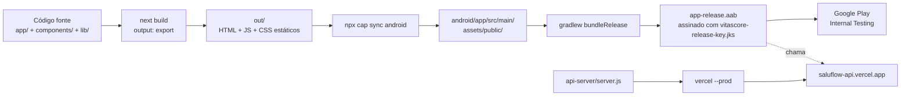

# SaluFlow — Arquitetura do Sistema

> Visão técnica do app de saúde corporativa SaluFlow (ex-VitaScore). Mobile-first, offline-first, com IA no servidor e dados pessoais no dispositivo.

---

## Sumário

- [1. Visão geral](#1-visão-geral)
- [2. Stack e versões](#2-stack-e-versões)
- [3. Estrutura de diretórios](#3-estrutura-de-diretórios)
- [4. Módulos funcionais](#4-módulos-funcionais)
- [5. Fluxo de análise de refeição (ponta a ponta)](#5-fluxo-de-análise-de-refeição-ponta-a-ponta)
- [6. Armazenamento local e LGPD](#6-armazenamento-local-e-lgpd)
- [7. Arquitetura de segurança](#7-arquitetura-de-segurança)
- [8. Servidor de IA (`api-server/`)](#8-servidor-de-ia-api-server)
- [9. Build pipeline](#9-build-pipeline)
- [10. Decisões arquiteturais](#10-decisões-arquiteturais)

---

## 1. Visão geral

SaluFlow é um aplicativo Android instalado no dispositivo do colaborador. Toda a UI é um bundle estático (Next.js `output: "export"`) empacotado pelo Capacitor. Dados de saúde pessoais ficam **no device** (Capacitor Preferences), e apenas chamadas de visão computacional (análise de refeição e leitura de balança) são enviadas a um servidor stateless hospedado na Vercel.



**Princípios:**

1. **Offline-first** — o app funciona sem internet para tudo que não dependa de IA (pontuação, histórico, metas, WHO-5, NR-1, leitura de biblioteca).
2. **Dados privados nunca saem do device** — nenhum PII é persistido no servidor. O servidor é stateless: recebe imagem, devolve JSON, esquece.
3. **Servidor de IA é fungível** — Claude e OpenAI são intercambiáveis via parâmetro `provider`. Se um cair, o outro assume.
4. **Sem banco de dados gerenciado** — não há Postgres, Firebase ou backend de usuário. Tudo o que você vê na tela foi gerado localmente a partir de dados que o próprio usuário inseriu.

---

## 2. Stack e versões

Extraído do `package.json`.

### 2.1. Cliente (raiz)

| Categoria | Pacote | Versão |
|---|---|---|
| Framework | `next` | **16.2.3** (App Router, `output: "export"`) |
| UI | `react` / `react-dom` | **19.2.4** |
| Runtime nativo | `@capacitor/core` / `@capacitor/android` | **^8.3.0** |
| Plugins Capacitor | `@capacitor/camera` | ^8.0.2 |
| | `@capacitor/geolocation` | ^8.2.0 |
| | `@capacitor/preferences` | ^8.0.1 |
| | `@capacitor/filesystem` | ^8.1.2 |
| | `@capacitor/haptics` | ^8.0.2 |
| | `@capacitor/local-notifications` | ^8.0.2 |
| | `@capacitor/share` | ^8.0.1 |
| | `@capacitor/splash-screen` | ^8.0.1 |
| | `@capacitor/status-bar` | ^8.0.2 |
| | `@capacitor/app` | ^8.1.0 |
| Health | `capacitor-health-connect` | ^0.7.0 (Google Fit/HC) |
| | `@perfood/capacitor-healthkit` | ^1.3.2 (iOS, não usado hoje) |
| Estilo | `tailwindcss` | **^4** |
| | `tailwind-merge` | ^3.5.0 |
| | `class-variance-authority` | ^0.7.1 |
| | `tw-animate-css` | ^1.4.0 |
| Animação | `framer-motion` | ^12.38.0 |
| Gráficos | `recharts` | ^3.8.1 |
| Ícones | `lucide-react` | **^1.8.0** (linha nova — cuidado com ícones renomeados) |
| UI primitivas | `@base-ui/react` | ^1.3.0 |
| | `shadcn` | ^4.2.0 |
| Dev | `typescript` | ^5 |
| | `eslint` + `eslint-config-next` | 16.2.3 |
| | `puppeteer` | ^24.40.0 (para `docs/generate-pdf.js`) |

> **Aviso importante do `AGENTS.md`:** esta versão do Next.js tem breaking changes — APIs, convenções e estrutura de arquivos diferem das versões anteriores. Sempre consulte `node_modules/next/dist/docs/` antes de escrever código novo de rota ou layout.

### 2.2. Servidor (`api-server/`)

| Pacote | Versão |
|---|---|
| `express` | **^5.2.1** |
| `cors` | ^2.8.6 |
| `@anthropic-ai/sdk` | ^0.87.0 |
| `openai` | ^6.34.0 |

Runtime: Node 20+, deploy como `@vercel/node` (ver `api-server/vercel.json`).

### 2.3. Android

- `applicationId`: `com.vitascore.app`
- `namespace`: `com.vitascore.app`
- `versionCode`: **20800**
- `versionName`: **"2.8.0"**
- `compileSdk`, `minSdk`, `targetSdk` — herdados de `rootProject.ext.*` (variables.gradle)
- JDK: **17** (`VERSION_17` em `compileOptions`)
- Keystore: `android/app/vitascore-release-key.jks` (alias `vitascore`, válido até 2053)
- Gradle Wrapper: **8.14**

---

## 3. Estrutura de diretórios

```
vitascore/
├── app/                          # Next.js App Router (páginas)
│   ├── layout.tsx                # Root layout — carrega AppShell
│   ├── page.tsx                  # Redirect inicial / splash
│   ├── home/                     # Dashboard principal
│   ├── onboarding/               # Primeira experiência
│   ├── nutricao/                 # Fluxo de foto de refeição
│   ├── monitorar/                # Hub de monitoramento
│   ├── peso/                     # Registro + OCR de balança
│   ├── sono/                     # Rastreamento de sono
│   ├── atividade/                # Passos / Health Connect
│   ├── checkin/                  # Check-in WHO-5
│   ├── metas/                    # Metas semanais
│   ├── desafios/                 # Gamificação
│   ├── nr1/                      # Dashboard NR-1 (empregador)
│   ├── seguro/                   # Co-pay / desconto saúde
│   ├── financeiro/               # Economia gerada
│   ├── parceiros/                # Benefícios e convênios
│   ├── biblioteca/               # Leitura (livros)
│   ├── aprenda/                  # Conteúdo educacional
│   ├── diario/                   # Journaling
│   ├── digital/                  # Tempo de tela
│   ├── relatorio/                # Export / PDF
│   ├── perfil/                   # Perfil do usuário
│   ├── config/                   # Configurações
│   ├── landing/                  # Página institucional (empresas)
│   └── globals.css               # Tailwind + tokens
│
├── components/
│   ├── layout/
│   │   ├── AppShell.tsx          # Container global (safe area, status bar)
│   │   └── BottomNav.tsx         # Tab bar inferior mobile
│   ├── cards/                    # Cards reutilizáveis de métrica
│   ├── charts/                   # Wrappers de Recharts
│   ├── score/                    # Visualizações do score de saúde
│   ├── gamification/             # Badges, streaks, níveis
│   └── ui/                       # Primitivas shadcn/base-ui
│
├── lib/
│   ├── health/                   # NÚCLEO — lógica de saúde (offline-first)
│   │   ├── meal-analyzer.ts      # Captura de foto + anti-fraude + hash + IA
│   │   ├── meal-tips.ts          # Dicas pós-análise
│   │   ├── weekly-goals.ts       # Metas semanais
│   │   ├── wellbeing-checkin.ts  # WHO-5 (bem-estar)
│   │   ├── copay-discount.ts     # Cálculo de co-pay / seguro
│   │   ├── weight-monitor.ts     # Peso + OCR de balança
│   │   ├── sleep-monitor.ts      # Sono
│   │   ├── screen-monitor.ts     # Tempo de tela
│   │   ├── finance-tracker.ts    # Economia gerada pelo app
│   │   ├── health-connect.ts     # Integração Google Fit / Health Connect
│   │   ├── healthkit.ts          # iOS (stub)
│   │   ├── manual.ts             # Entrada manual de métricas
│   │   ├── data-export.ts        # LGPD — exportar dados do usuário
│   │   ├── api-config.ts         # Endpoint do servidor de IA
│   │   ├── types.ts              # Tipos compartilhados
│   │   └── index.ts              # Barrel
│   │
│   ├── ai/
│   │   └── meal-ai.ts            # Cliente do /analyze-meal (fetch + parsing)
│   │
│   ├── library/
│   │   └── books.ts              # Catálogo de livros do módulo Biblioteca
│   │
│   ├── reports/                  # Geração de relatórios (PDF, export)
│   ├── user-profile.ts           # Perfil local (idade, gênero, peso, altura)
│   ├── vitascore.ts              # Cálculo do score consolidado
│   ├── mock-data.ts              # Dados de exemplo para dev
│   └── utils.ts                  # `cn()` do shadcn + helpers
│
├── hooks/                        # React hooks custom
├── public/                       # Assets estáticos
│
├── api-server/                   # SUBPROJETO — servidor de IA (Vercel)
│   ├── server.js                 # Express + endpoints
│   ├── package.json              # Dependências isoladas
│   └── vercel.json               # Config de deploy
│
├── android/                      # Projeto Gradle (Capacitor)
│   ├── app/
│   │   ├── build.gradle          # versionCode / signing / deps
│   │   ├── vitascore-release-key.jks   # Keystore de release
│   │   └── src/main/assets/public/     # <- destino do `cap sync`
│   ├── gradle.properties
│   └── gradlew / gradlew.bat
│
├── docs/                         # Documentação (este arquivo)
├── out/                          # Output do `next build` (gerado)
├── capacitor.config.ts           # appId, webDir, plugins
├── next.config.ts                # output: "export"
├── tailwind.config                — implícito (Tailwind v4 via PostCSS)
├── tsconfig.json
└── package.json
```

---

## 4. Módulos funcionais

Cada módulo é uma pasta em `app/` + um arquivo de lógica em `lib/health/`. Todos são **offline-first** e persistem em `Preferences`.

| Módulo | Rota | Lógica | O que faz |
|---|---|---|---|
| **Nutrição** | `/nutricao` | `lib/health/meal-analyzer.ts` + `lib/ai/meal-ai.ts` | Captura foto (câmera obrigatória), passa por anti-fraude, envia ao servidor, recebe score Noom Color (0–100) + macros estimados |
| **Peso** | `/peso` | `lib/health/weight-monitor.ts` | Registro manual ou OCR de display de balança (`/read-scale`) |
| **Sono** | `/sono` | `lib/health/sleep-monitor.ts` | Horário manual ou Health Connect |
| **Atividade** | `/atividade` | `lib/health/health-connect.ts` | Passos, distância, calorias do Google Fit |
| **Check-in WHO-5** | `/checkin` | `lib/health/wellbeing-checkin.ts` | Questionário validado de bem-estar (OMS), 5 itens |
| **Metas semanais** | `/metas` | `lib/health/weekly-goals.ts` | 3 metas por semana, reset aos domingos |
| **Desafios** | `/desafios` | `components/gamification/*` | Streaks, badges, níveis |
| **NR-1** | `/nr1` | — | Dashboard agregado de saúde mental para cumprimento da NR-1 |
| **Seguro / Co-pay** | `/seguro` | `lib/health/copay-discount.ts` | Cálculo de desconto no plano baseado no score |
| **Financeiro** | `/financeiro` | `lib/health/finance-tracker.ts` | Economia estimada gerada pelo app |
| **Parceiros** | `/parceiros` | — | Lista de benefícios e convênios |
| **Biblioteca** | `/biblioteca` | `lib/library/books.ts` | Leitura de livros (gamificada) |
| **Aprenda** | `/aprenda` | — | Conteúdo educacional |
| **Diário** | `/diario` | — | Journaling |
| **Digital** | `/digital` | `lib/health/screen-monitor.ts` | Tempo de tela |
| **Relatório** | `/relatorio` | `lib/reports/*` + `lib/health/data-export.ts` | Export LGPD e PDFs |
| **Perfil** | `/perfil` | `lib/user-profile.ts` | Dados do usuário (fica no device) |

O **score consolidado** (VitaScore legado — ainda se chama assim no código) é calculado em `lib/vitascore.ts`, combinando nutrição, sono, atividade, WHO-5 e consistência das metas.

---

## 5. Fluxo de análise de refeição (ponta a ponta)

O fluxo mais complexo do app. Envolve plugins nativos, anti-fraude, servidor de IA e persistência local.



**Pontos de falha tratados:**

- Câmera negada → erro explícito, sem fallback para galeria (anti-fraude)
- GPS negado → foto aceita, mas `hasLocation=false` abaixa o score de confiança
- Servidor offline → mensagem "análise indisponível, tente mais tarde"
- IA retorna JSON inválido → `502` tratado no cliente, refeição não é salva
- Hash duplicado → refeição rejeitada ("foto já usada")
- Timestamp fora da janela de ±2 min → refeição rejeitada

---

## 6. Armazenamento local e LGPD

Tudo persiste via `@capacitor/preferences` (chave-valor, Android SharedPreferences / iOS UserDefaults). O helper padrão (ex.: `lib/health/meal-analyzer.ts`) tem fallback para `localStorage` no modo web:

```ts
async function getStore(key: string) {
  try {
    const { Preferences } = await import("@capacitor/preferences");
    const { value } = await Preferences.get({ key });
    return value ? JSON.parse(value) : null;
  } catch {
    const val = localStorage.getItem(key);
    return val ? JSON.parse(val) : null;
  }
}
```

**Chaves típicas (namespacing por módulo):**

- `meal_analyses` — histórico de refeições
- `meal_hashes` — hashes das fotos já usadas (anti-reuso)
- `weekly_goals` — metas atuais
- `wellbeing_checkins` — histórico WHO-5
- `user_profile` — idade, peso, altura, gênero
- `vitascore_daily` — score consolidado por dia
- `copay_state` — cálculo de co-pay

**LGPD — garantias do código:**

1. **Nenhum dado pessoal trafega para o servidor.** O `/analyze-meal` recebe apenas a imagem base64 (sem metadados, sem ID do usuário). O servidor não loga corpo de requisição.
2. **Export sob demanda** — `lib/health/data-export.ts` empacota todas as chaves em JSON para o titular baixar (direito de portabilidade).
3. **Deleção imediata** — "Apagar meus dados" em `/config` limpa todas as chaves `Preferences.clear()`.
4. **Sem telemetria** — o app não usa Firebase Analytics, Crashlytics nem equivalentes.

Referência regulatória: ver `~/.claude/memory/project_vitascore_regras.md` para o checklist de RN 498/499 da ANS, NR-1 e LGPD antes de codar features sensíveis.

---

## 7. Arquitetura de segurança

### 7.1. Anti-fraude de foto de refeição

Implementado em `lib/health/meal-analyzer.ts`. 6 camadas:

| Camada | O quê | Onde |
|---|---|---|
| 1. Origem obrigatória | Câmera nativa — galeria bloqueada | `Camera.getPhoto({ source: CameraSource.Camera })` |
| 2. Timestamp fresco | Foto ±2 min do agora | `capturedAt` comparado a `Date.now()` |
| 3. Foto-de-foto | IA detecta moiré, borda de tela, reflexo | Campo `isScreenPhoto` no JSON retornado |
| 4. Geolocalização | GPS anexado ao registro | `Geolocation.getCurrentPosition()` |
| 5. Hash SHA-256 | Foto + device + timestamp → hash único | `crypto.subtle.digest("SHA-256", ...)` |
| 6. Device fingerprint | User agent no payload do hash | — |

Cada refeição recebe um `AntifraudResult` com `score 0–100`. Abaixo do threshold, o registro é marcado como "suspeito" e não conta para o VitaScore do dia.

### 7.2. Servidor

- **Token de app** — header `x-saluflow-token` comparado com `process.env.SALUFLOW_APP_TOKEN`. Não é segurança forte (APK pode ser decompilado), mas evita abuso casual / scraping do endpoint público.
- **Rate limit** — `Map` em memória, janela de 60 s, máximo 20 requisições por IP. Em Vercel serverless, o mapa é por instância / cold start — é best-effort.
- **CORS aberto** — `app.use(cors())` sem allowlist. Aceitável porque não há sessão, cookie nem dados sensíveis no servidor.
- **Prompts rigorosos** — os prompts em `server.js` (`MEAL_PROMPT`, `SCALE_PROMPT`) forçam retorno JSON e tentam evitar alucinação ("NÃO invente ingredientes que não estão visíveis").

### 7.3. Keystore

- `android/app/vitascore-release-key.jks` (alias `vitascore`, válido até 2053)
- Senha hardcoded em `android/app/build.gradle` — conveniente para CI simples, mas o `.jks` **não pode vazar**
- Sem rotação de chaves — perda do keystore implica em `applicationId` novo e nova listagem na Play Store

---

## 8. Servidor de IA (`api-server/`)

### 8.1. Endpoints

| Método | Rota | Input | Output |
|---|---|---|---|
| `GET` | `/` | — | health check + lista de providers |
| `POST` | `/analyze-meal` | `{ image, provider?, model? }` | JSON com score, flags nutricionais, caloricDensity |
| `POST` | `/read-scale` | `{ image, provider?, model? }` | JSON com `weightKg`, `confidence`, `isScale` |

`provider` default = `"openai"` · `model` default = `"gpt-4o-mini"`.
Alternativa: `provider: "claude"` · `model: "claude-haiku-4-5-20251001"`.

### 8.2. Stateless

Não há DB, nem cache, nem fila. Cada requisição:

1. Passa pelo rate limit (Map em memória, descartado entre cold starts)
2. Passa pelo token check
3. Extrai `base64` + `mediaType` do data URL
4. Chama o provider escolhido via SDK oficial
5. Extrai JSON da resposta de texto (`extractJson`) tolerando markdown fences
6. Devolve o JSON ao cliente

Isso torna o servidor **idempotente, escalável horizontalmente e auditável**.

---

## 9. Build pipeline



O app cliente e o servidor são publicados **independentemente**. Mudança no servidor não exige novo APK (desde que o contrato JSON seja mantido).

---

## 10. Decisões arquiteturais

| # | Decisão | Motivo |
|---|---|---|
| 1 | Next.js **estático** (`output: "export"`), sem SSR | Precisa virar bundle que o Capacitor empacota. Também elimina servidor e reduz custo a ~zero. |
| 2 | Capacitor em vez de React Native | Reaproveitamento total de componentes web + DX do Next.js + ecossistema Tailwind/shadcn. |
| 3 | Servidor de IA **separado** do cliente | Protege as API keys (não ficam no APK), permite trocar provider sem re-publicar, facilita rate limit e auditoria. |
| 4 | Preferences no device, **sem backend de usuário** | Compliance LGPD automática: se o dado nunca sai, não há vazamento possível. Também elimina custo de infra. |
| 5 | Dois provedores de IA (Claude + OpenAI) | Resiliência contra outage + benchmarking de qualidade. Default em OpenAI (`gpt-4o-mini`) por custo. |
| 6 | Anti-fraude no cliente | Fraude é inevitável em app de gamificação com co-pay de seguro. As 6 camadas encarecem o abuso sem gerar atrito para usuário honesto. |
| 7 | Score consolidado local (`lib/vitascore.ts`) | O score é função pura dos dados locais — determinístico, auditável, explicável ao colaborador e ao RH. |
| 8 | Keystore versionado no repo | Trade-off: conveniência para um projeto de time pequeno. Deve ser movido para variável de ambiente de CI quando o projeto crescer. |
