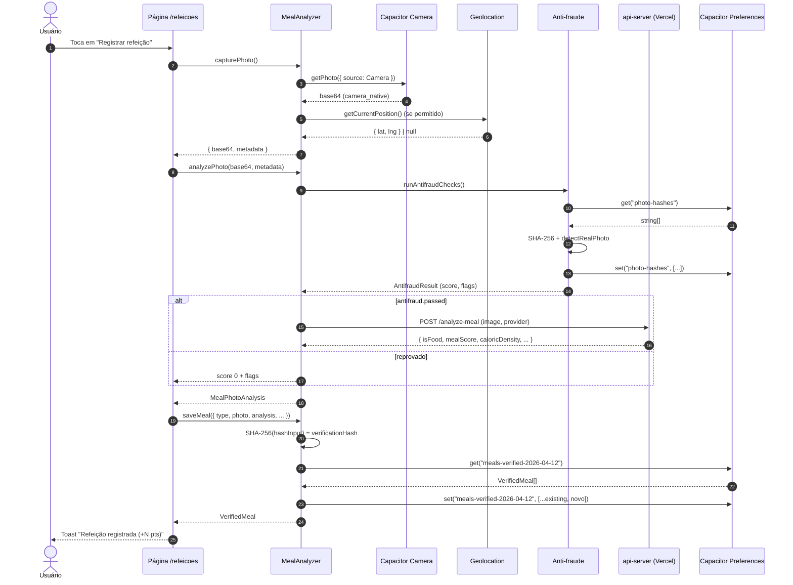

# 03 — Armazenamento Local (sem banco)

> Como o SaluFlow persiste dados sem usar banco remoto. Local-first, LGPD-by-design.

## Sumário

- [Visão geral](#visão-geral)
- [Por que não existe banco remoto](#por-que-não-existe-banco-remoto)
- [Mecanismos de persistência](#mecanismos-de-persistência)
- [Padrão de acesso (getStore/setStore)](#padrão-de-acesso-getstoresetstore)
- [Tabela de chaves do storage](#tabela-de-chaves-do-storage)
- [Hash anti-fraude (SHA-256)](#hash-anti-fraude-sha-256)
- [Exportação de dados (portabilidade LGPD)](#exportação-de-dados-portabilidade-lgpd)
- [Deleção total (direito ao esquecimento)](#deleção-total-direito-ao-esquecimento)
- [Fluxo de gravação de uma refeição (diagrama)](#fluxo-de-gravação-de-uma-refeição-diagrama)
- [Limitações conhecidas](#limitações-conhecidas)

---

## Visão geral

O SaluFlow **não possui banco de dados remoto**. Toda a informação de saúde, peso, bem-estar, finanças e biblioteca fica **exclusivamente no dispositivo do usuário**, sob um par de abstrações que tentam primeiro o Capacitor Preferences (nativo Android/iOS) e caem para `localStorage` quando estão na versão web.

Essa decisão não é um atalho de engenharia: é um **requisito de produto** derivado da análise de regulação (LGPD, NR-1, RN 498/499 ANS) documentada em `~/.claude/projects/.../project_vitascore_regras.md`.

## Por que não existe banco remoto

- **LGPD (Lei 13.709/2018).** Dados de saúde são classificados como **sensíveis** (art. 5º, II) e exigem base legal específica + tratamento redobrado. Quanto menos dado sai do aparelho, menor o risco jurídico e operacional.
- **Minimização e local-first.** O princípio de minimização (art. 6º, III) está no centro do design: o backend só vê foto + resultado da análise no instante da chamada, nunca armazena nada.
- **NR-1 (fator psicossocial) com dados agregados.** O relatório para o RH/empresa é **agregado e anônimo** (WHO-5). Nunca existe um registro individual em servidor.
- **Portabilidade nativa.** Sem banco, a portabilidade é simplesmente um export JSON local (art. 18, V da LGPD).
- **Direito ao esquecimento one-click.** Sem banco remoto, apagar tudo é um loop local — não há back-office, backup offsite ou DPA para coordenar.
- **Menor superfície de ataque.** Sem endpoint "read user history" não há como vazar histórico em massa.

> O único servidor HTTP do projeto (`api-server/`) é um **proxy stateless** de IA — ele recebe uma imagem, devolve JSON e não grava nada. Veja `docs/04-api-reference.md`.

## Mecanismos de persistência

O SaluFlow usa dois backends de storage, nessa ordem de prioridade:

1. **Capacitor Preferences** — nativo Android/iOS. Persistência real em `SharedPreferences` / `NSUserDefaults`. Sobrevive ao fechamento do app, ao update e (no Android moderno) a limpezas parciais de cache.
2. **Fallback web `localStorage`** — quando roda no navegador ou em testes. O mesmo formato JSON é gravado na chave.

Todos os módulos de domínio (`lib/health/*.ts`, `lib/ai/meal-ai.ts`, `lib/health/data-export.ts`) usam o mesmo par de helpers:

```ts
async function getStore(key: string): Promise<any> {
  try {
    const { Preferences } = await import("@capacitor/preferences");
    const { value } = await Preferences.get({ key });
    return value ? JSON.parse(value) : null;
  } catch {
    const val = localStorage.getItem(key);
    return val ? JSON.parse(val) : null;
  }
}

async function setStore(key: string, data: any): Promise<void> {
  const value = JSON.stringify(data);
  try {
    const { Preferences } = await import("@capacitor/preferences");
    await Preferences.set({ key, value });
  } catch {
    localStorage.setItem(key, value);
  }
}
```

Esse padrão é **duplicado intencionalmente** em cada lib (sem barrel import) para manter cada módulo autossuficiente e sem custo de árvore de dependências.

## Padrão de acesso (getStore/setStore)

- Toda escrita é **JSON serializado**. Nunca há strings soltas (exceto `"true"`/`"false"` em algumas flags do onboarding).
- **Leituras falham silenciosamente** — retornam `null` e o chamador decide o default. Isso evita crashes no primeiro boot.
- **Não há índice**. Chaves são montadas por convenção (ex.: `meals-verified-YYYY-MM-DD`). Para ler a semana inteira, a lib itera 7 chaves.
- **Não há migração.** Breaking changes no shape de um objeto precisam ser tratadas como "overwrite no save" ou com um import/export manual.

## Tabela de chaves do storage

Cada chave abaixo corresponde a **um registro JSON completo** — não há colunas nem rows. A coluna "Lib" aponta para o arquivo que é dono daquela chave.

| Chave | Tipo | Conteúdo | Lib |
|---|---|---|---|
| `meals-verified-YYYY-MM-DD` | `VerifiedMeal[]` | Lista de refeições verificadas daquele dia (foto, metadata, análise IA, pontos, hash de verificação). Uma chave por dia. | `lib/health/meal-analyzer.ts` |
| `photo-hashes` | `string[]` | Últimos 500 hashes SHA-256 de fotos de refeição já usadas. Anti-reuso. | `lib/health/meal-analyzer.ts` |
| `weight-profile` | `WeightProfile` | Altura, meta de peso, agendamento semanal e **todas** as entradas de peso (`entries: WeightEntry[]`). Entrada única. | `lib/health/weight-monitor.ts` |
| `wellbeing-YYYY-MM-DD` | `WellbeingResponse` | Resposta WHO-5 do dia (5 perguntas 0-5, score 0-100, categoria). Uma chave por dia. | `lib/health/wellbeing-checkin.ts` |
| `wellbeing-history` | `WellbeingResponse[]` | Histórico dos últimos 90 dias de check-ins para tendência agregada. | `lib/health/wellbeing-checkin.ts` |
| `saluflow_week_plan` | `WeekPlan` | Plano da semana corrente: 3 metas personalizadas, progresso, bônus. Sobrescrito a cada semana. | `lib/health/weekly-goals.ts` |
| `saluflow_week_history` | `WeekHistory[]` | Histórico das últimas 52 semanas (progresso, moedas ganhas). | `lib/health/weekly-goals.ts` |
| `saluflow_coin_balance` | `CoinBalance` | Saldo de moedas: total, mês, semana, streak. | `lib/health/weekly-goals.ts` |
| `saluflow_goal_profile` | `UserGoalProfile` | Perfil base (steps/dia, sono médio, adaptações PCD/gestante) usado para personalizar metas. | `lib/health/weekly-goals.ts` |
| `finance-expenses-YYYY-MM` | `Expense[]` | Despesas manuais daquele mês por categoria. Uma chave por mês. | `lib/health/finance-tracker.ts` |
| `finance-budget-YYYY-MM` | `MonthlyBudget` | Orçamento do mês, total e por categoria. | `lib/health/finance-tracker.ts` |
| `finance-history` | `string[]` | Lista de meses já tocados (para consolidação e relatório NR-1). | `lib/health/finance-tracker.ts` |
| `saluflow-library-status` | `Record<BookId, ReadingStatus>` | Estado de leitura dos livros da biblioteca (`lendo`/`lido`/`quero-ler`/`pausado`). | `app/biblioteca/page.tsx` |
| `saluflow-library-minutes` | `string` (int) | Minutos totais lidos (somado quando o usuário marca livro como lido). | `app/biblioteca/page.tsx` |
| `saluflow-ai-config` | `AiConfig` | Provider atual (`server`/`claude`/`openai`/`none`), modelo escolhido e API key local (só existe se o usuário usar sua própria chave). | `lib/ai/meal-ai.ts` |
| `user-profile` | `{name, age, score, status, streak}` | Perfil básico para exibição no dashboard. | `app/perfil/page.tsx` |
| `sleep-history` | `SleepRecord[]` | Registros de sono (duração, método de detecção, hash). | `lib/health/sleep-monitor.ts` |
| `insurance-config` | `InsuranceConfig` | Configuração de desconto de seguro/copay (simulação). | `app/config/page.tsx` |
| `health-connected` | `"true"` \| `"false"` | Flag de conexão com Health Connect (Android) / HealthKit (iOS). | `app/config/page.tsx` |
| `saluflow-onboarded` | `"true"` | Flag de onboarding concluído. Usada para pular wizard. | `app/onboarding/page.tsx` |
| `lgpd-last-export` | ISO string | Timestamp do último `exportAllData()`. | `lib/health/data-export.ts` |

> Atalho mental: **tudo começa com um prefixo claro** (`meals-`, `weight-`, `wellbeing-`, `saluflow_*`, `finance-`, `sleep-`). O `deleteAllData()` depende dessa convenção — renomear sem atualizar o filtro pode deixar dados órfãos.

## Hash anti-fraude (SHA-256)

Cada foto (refeição ou balança) gera um **hash determinístico** dos primeiros 5.000 caracteres da string base64. Isso faz três coisas:

1. **Detecta reenvio da mesma foto** (`photo-hashes` guarda um ring buffer com os 500 últimos). Se bater, a foto é rejeitada.
2. **Integra metadados**. No `saveMeal()`, o hash de verificação (`verificationHash`) é gerado sobre `timestamp + type + method + photoHash + mealScore + antifraudScore + location`. Qualquer edição invalida a integridade.
3. **Alimenta o export LGPD**. O `exportAllData()` calcula um `dataIntegrityHash` sobre o payload inteiro, permitindo que o usuário prove a outra seguradora que os dados não foram adulterados.

Implementação (mesmo código duplicado em `meal-analyzer.ts`, `weight-monitor.ts` e `data-export.ts`):

```ts
async function generateHash(data: string): Promise<string> {
  try {
    const encoder = new TextEncoder();
    const buffer = await crypto.subtle.digest("SHA-256", encoder.encode(data));
    return Array.from(new Uint8Array(buffer))
      .map((b) => b.toString(16).padStart(2, "0"))
      .join("");
  } catch {
    // Fallback não-crypto (WebView antigo, testes)
    let hash = 0;
    for (let i = 0; i < data.length; i++) {
      hash = (hash << 5) - hash + data.charCodeAt(i);
      hash |= 0;
    }
    return Math.abs(hash).toString(16).padStart(16, "0");
  }
}
```

`crypto.subtle.digest` é a API padrão da **WebCrypto**, disponível em todos os WebViews modernos (Android 5+, iOS 10+, Chromium, Firefox, Safari). O fallback só dispara em ambientes muito antigos.

## Exportação de dados (portabilidade LGPD)

`DataExporter.exportAllData()` (`lib/health/data-export.ts`) varre **todas as chaves** do storage via `Preferences.keys()` (ou iteração manual do `localStorage`) e monta um objeto `ExportedHealthData` com:

- `exportDate` / `exportVersion`
- `user` (nome, idade — sem CPF, sem e-mail)
- `summary` (score atual, streak, dias rastreados, `dataIntegrityHash`)
- `sleepHistory`, `weightHistory` (apenas campos relevantes + hash de verificação)
- `nutritionSummary` (agregados — total de refeições, % verificadas por foto, média do score)
- `activitySummary`, `digitalWellbeing` (placeholders enquanto os módulos estão parciais)
- `lgpdInfo` (flags confirmando `dataStoredLocally: true`, `noCloudUpload: true`, `dataRetentionDays: 365`)

O download é feito em duas rotas:

1. **Nativo (Capacitor).** Escreve JSON no `Directory.Cache` via `@capacitor/filesystem` e dispara `Share.share()` — o usuário escolhe onde salvar (Drive, WhatsApp, e-mail).
2. **Web.** Cria um `Blob` e força download com um `<a>` temporário (`saluflow-export-YYYY-MM-DD.json`).

Cada exportação regrava `lgpd-last-export` com o timestamp ISO — útil para auditoria interna e para lembretes de "você exportou há X dias".

## Deleção total (direito ao esquecimento)

`DataExporter.deleteAllData()` implementa o **art. 18, VI da LGPD** (eliminação a pedido do titular). A estratégia é varredura de chaves + filtro por prefixo:

```ts
const vitaKeys = keys.filter(
  (k) =>
    k.startsWith("user-profile") ||
    k.startsWith("sleep-") ||
    k.startsWith("weight-") ||
    k.startsWith("meals-") ||
    k.startsWith("nutrition-") ||
    k.startsWith("screen-") ||
    k.startsWith("activity-") ||
    k.startsWith("saluflow-") ||
    k.startsWith("lgpd-") ||
    k.startsWith("onboarding") ||
    k.startsWith("streak") ||
    k.startsWith("challenges") ||
    k.startsWith("weekly-") ||
    k.startsWith("daily-"),
);
for (const key of vitaKeys) {
  await removeStore(key);
}
```

Depois do loop, o usuário é levado de volta ao onboarding. Não há "lixeira" nem recuperação — é **hard delete** no storage do aparelho.

> Atenção: `finance-*` e `wellbeing-*` ainda **não** estão na lista de prefixos. Isso é um débito conhecido — veja `lib/health/data-export.ts:382`. Adicionar antes de qualquer publicação que se apoie formalmente em LGPD como argumento de venda.

## Fluxo de gravação de uma refeição (diagrama)



## Limitações conhecidas

- **Sem sincronização multi-dispositivo.** Trocar de aparelho = perder histórico (a menos que o usuário exporte antes).
- **Sem backup automático.** Um `Clear app data` no Android zera tudo — documentado na UI de onboarding.
- **Sem transações.** `setStore` é assíncrono e não atômico; dois writes concorrentes na mesma chave podem deixar o último vencer. Em prática isso não acontece porque o app é single-user e mobile-only.
- **Tamanho.** `localStorage` em WebViews tem limite típico de 5 MB. Fotos base64 inflam rápido — por isso o redimensionamento para 800px e a política de **manter no máximo 7 dias** de refeições com foto integral é importante (não implementada em todos os fluxos ainda).
- **Débito de prefixos no `deleteAllData`.** Conforme citado acima, `finance-*` e `wellbeing-*` não são incluídos no direito ao esquecimento.
