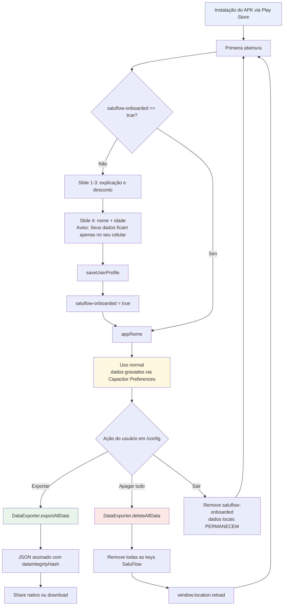

# 05 — Autenticação e Privacidade

> Documento técnico do SaluFlow (antes VitaScore). Todo conteúdo em pt-BR.

## Sumário

1. [Visão geral — por que não há autenticação](#1-visão-geral--por-que-não-há-autenticação)
2. [Identificação do usuário — flag `saluflow-onboarded`](#2-identificação-do-usuário--flag-saluflow-onboarded)
3. [Autenticação do servidor de IA](#3-autenticação-do-servidor-de-ia)
4. [Assinatura do APK — Play App Signing](#4-assinatura-do-apk--play-app-signing)
5. [Fluxo de consentimento LGPD no onboarding](#5-fluxo-de-consentimento-lgpd-no-onboarding)
6. [Direitos do usuário (LGPD Art. 18)](#6-direitos-do-usuário-lgpd-art-18)
7. [Diagrama de fluxo LGPD](#7-diagrama-de-fluxo-lgpd)
8. [Notas de segurança — riscos conhecidos](#8-notas-de-segurança--riscos-conhecidos)

---

## 1. Visão geral — por que não há autenticação

O SaluFlow **não possui autenticação de usuário**. Não há login, senha, e-mail, CPF, cadastro em servidor, nem conta centralizada. Essa decisão é deliberada e decorre de três motivos conectados:

1. **Local-first por princípio LGPD.** A arquitetura segue o modelo "menor quantidade de dados possível para a finalidade" (LGPD Art. 6º, III — minimização). Se o app não precisa de identidade para funcionar, não coletar identidade é o caminho mais seguro.
2. **Dados sensíveis de saúde ficam apenas no dispositivo.** Pesagem, refeições, sono, check-ins de bem-estar (WHO-5) e streaks são gravados exclusivamente via `@capacitor/preferences` ou `localStorage` — nunca enviados a um backend SaluFlow. Um vazamento no servidor seria impossível de acontecer, pois o servidor **não guarda nada do usuário**.
3. **Conformidade trabalhista.** O produto é vendido a empresas para conformidade com a NR-1 (risco psicossocial) e à ANS via RN 498/499. A empresa contratante **não pode** saber o score individual nem a resposta individual do WHO-5, sob pena de discriminação por saúde (CLT e LGPD Art. 11 — dado de saúde é sensível). Como não há login, é tecnicamente impossível vincular uma resposta a uma pessoa nominada.

**Consequência prática:** cada instalação do APK é tratada como "um usuário anônimo". Se o funcionário desinstalar e reinstalar, os dados locais são perdidos e um novo "usuário" começa do zero — o app não tem como recuperar nada, porque nada foi enviado.

---

## 2. Identificação do usuário — flag `saluflow-onboarded`

A única marca que o app usa para saber se o onboarding já foi concluído é uma flag booleana persistida em `localStorage`:

```ts
// app/onboarding/page.tsx:219
localStorage.setItem("saluflow-onboarded", "true");
```

Essa flag é lida pelo shell da aplicação antes de decidir se redireciona para `/onboarding` ou `/home`. Ela **não contém PII** — é literalmente a string `"true"`.

Junto com ela, o perfil pessoal (`name` e `age`) é gravado pela função `saveUserProfile()` (`lib/user-profile.ts`) e acessado pelos módulos de saúde. Esses dois campos (nome e idade) são a **totalidade** da PII que o app coleta — e mesmo esses dois ficam exclusivamente no dispositivo, nunca saem dele.

**Logout** (na verdade, "resetar o app") em `app/config/page.tsx:293` simplesmente remove a flag:

```ts
const handleLogout = () => {
  localStorage.removeItem("saluflow-onboarded");
  router.push("/onboarding");
};
```

Isso força o usuário a refazer o onboarding, mas **não apaga os dados locais** — para apagar tudo, o caminho correto é o "direito ao esquecimento" (seção 6).

---

## 3. Autenticação do servidor de IA

O único endpoint remoto contatado pelo app é o servidor de análise de foto de refeição (Claude Vision / OpenAI Vision), que roda em um backend proprietário para **evitar expor a chave da API no APK**. A autenticação desse endpoint é feita por um header compartilhado:

```ts
// lib/ai/meal-ai.ts:441
const res = await httpPost(
  `${SALUFLOW_SERVER_URL}/analyze-meal`,
  { "x-saluflow-token": SALUFLOW_APP_TOKEN },
  { image: dataUrl, provider: serverProvider, model: serverModel },
);
```

### Sobre a força desse token

Esse token **não é um segredo forte**. Ele está compilado no bundle JavaScript do APK e pode ser extraído por qualquer pessoa que descompile o pacote Android (apktool, dex2jar, ou inspecionando o Webview). O `x-saluflow-token` serve para **bloquear uso casual/acidental do endpoint por terceiros** — não para autenticar o usuário nem para garantir confidencialidade.

**O que o servidor não faz:**
- Não registra quem enviou a imagem (sem user-id);
- Não persiste a imagem após processar o prompt;
- Não guarda o score de refeição (quem guarda é o dispositivo);
- Não aceita upload sem o header correto.

**O que o servidor faz:**
- Recebe a foto em base64, chama o modelo de visão (OpenAI ou Claude), retorna o JSON com flags nutricionais e `isScreenPhoto`. Ponto.

### Alternativa BYO-key

Em `app/config/page.tsx` (seção "Configuração de IA", usando `getAiConfig` / `setAiConfig` de `lib/ai/meal-ai.ts:112`), o usuário técnico avançado pode **trazer sua própria chave** (Claude ou OpenAI). Nesse modo, a chave é armazenada localmente sob a key `saluflow-ai-config` e as chamadas à API vão diretamente do dispositivo para o provedor — o servidor SaluFlow é contornado.

---

## 4. Assinatura do APK — Play App Signing

### Keystore local

O repositório mantém um keystore legado usado para builds locais e para a primeira submissão à Play Store:

```groovy
// android/app/build.gradle (trecho signingConfigs)
signingConfigs {
    release {
        storeFile file('vitascore-release-key.jks')
        storePassword 'vitascore2026'
        keyAlias 'vitascore'
        keyPassword 'vitascore2026'
    }
}
```

Arquivo: `android/app/vitascore-release-key.jks`.

### Fluxo do Google Play App Signing

A partir da primeira submissão, o Google passou a gerenciar a chave de assinatura final do app (Play App Signing). O fluxo real em produção é:

1. O desenvolvedor gera um **AAB** (Android App Bundle) assinado pela chave local (`vitascore-release-key.jks`) — essa é a "upload key".
2. O AAB é enviado ao Google Play Console.
3. O Google **re-assina** o AAB com a chave de produção custodiada por eles (que nunca sai da infra do Google).
4. O APK distribuído aos usuários finais é o APK re-assinado pelo Google.

Portanto, a `vitascore2026` é a senha da **upload key**, não da chave de distribuição real. Mesmo se vazar, o atacante conseguiria, no máximo, fazer uploads em nome do desenvolvedor no Play Console — e o Google oferece fluxo de rotação de upload key via suporte.

### Recomendações (dívida técnica)

- Mover as senhas do `build.gradle` para variáveis de ambiente (`signing.properties` fora do git) antes de abrir o repositório publicamente.
- Rotacionar a upload key quando o projeto sair do estado prototipo.

---

## 5. Fluxo de consentimento LGPD no onboarding

O onboarding atual (`app/onboarding/page.tsx`) tem 4 slides: Hero, Como funciona, Apólice/desconto, e Nome/idade. O consentimento é **implícito** (aceite por uso), mas já contém a frase de transparência obrigatória no slide de coleta:

```tsx
// app/onboarding/page.tsx:257
<p className="text-sm text-[#5F6368] mb-8 text-center">
  Seus dados ficam apenas no seu celular.
</p>
```

Essa frase aparece diretamente acima dos campos `name` e `age`, cumprindo a função de aviso prévio e fundamento legal (Art. 9º LGPD — informação clara ao titular).

A finalização do onboarding chama `saveUserProfile()` e marca a flag `saluflow-onboarded=true`. O consentimento granular (por finalidade — movimento, sono, nutrição) é gerenciado depois, em `app/config/page.tsx` (seção "Sensores"), onde o usuário liga/desliga câmera, GPS e acelerômetro individualmente.

**Dívida técnica conhecida:** não existe, hoje, uma tela explícita "eu li e aceito a política de privacidade" com link para `docs/PRIVACY_POLICY.md`. Para lançamento à ANS e RH de grandes contas, essa tela deve ser adicionada antes de a flag `saluflow-onboarded` ser gravada, para atender ao princípio do consentimento inequívoco (Art. 5º, XII).

---

## 6. Direitos do usuário (LGPD Art. 18)

Todas as operações LGPD vivem em `lib/health/data-export.ts` e são expostas na tela `app/config/page.tsx` (seção "Dados e LGPD").

### 6.1 Portabilidade (Art. 18, V)

```ts
// lib/health/data-export.ts:154
static async exportAllData(): Promise<ExportedHealthData>
```

`DataExporter.exportAllData()` varre todas as keys locais (`user-profile`, `sleep-history`, `weight-profile`, `meals-verified-*`, etc.), monta um objeto `ExportedHealthData` com:

- Perfil mínimo (`name`, `age`);
- Histórico de sono com `verificationHash` por entrada;
- Histórico de peso com método e hash;
- Sumário nutricional agregado (total de refeições, verificadas por foto, score médio);
- `dataIntegrityHash` — SHA-256 de todo o payload, permitindo que outra seguradora valide que os dados não foram adulterados no JSON exportado (`lib/health/data-export.ts:230`);
- Bloco `lgpdInfo` declarando que o dado está local, não há upload, etc.

O download é feito por `DataExporter.downloadAsJson()` (`lib/health/data-export.ts:283`), que tenta o Share nativo do Capacitor e faz fallback para download do browser.

### 6.2 Exclusão total / direito ao esquecimento (Art. 18, VI)

```ts
// lib/health/data-export.ts:381
static async deleteAllData(): Promise<void>
```

Varre todas as keys com prefixos conhecidos do SaluFlow (`user-profile`, `sleep-`, `weight-`, `meals-`, `nutrition-`, `screen-`, `activity-`, `saluflow-`, `lgpd-`, `onboarding`, `streak`, `challenges`, `weekly-`, `daily-`) e apaga cada uma via `Preferences.remove()` (ou `localStorage.removeItem()` no fallback web).

O botão correspondente está em `app/config/page.tsx` com confirmação modal (`showDeleteConfirm`). Após a deleção, a página recarrega (`window.location.reload()`), forçando o app a voltar ao estado pré-onboarding.

### 6.3 Acesso (Art. 18, II) e Correção (Art. 18, III)

O acesso é contínuo — o próprio app é a interface de leitura dos dados. A correção é feita em duas camadas: (a) no perfil (`name`, `age`) via `app/perfil/page.tsx`; (b) nos registros de refeição, via `MealAnalyzer.updateMeal()` em `lib/health/meal-analyzer.ts:683`, que recalcula o score quando o usuário edita flags manualmente e marca `editedByUser: true`.

---

## 7. Diagrama de fluxo LGPD



---

## 8. Notas de segurança — riscos conhecidos

Esta seção documenta honestamente as fraquezas do modelo atual para que a equipe decida quando endereçar cada uma.

### 8.1 Credenciais hardcoded no `build.gradle`

A senha `vitascore2026` do keystore está versionada em `android/app/build.gradle`. **Impacto real baixo** porque (a) é upload key, não chave de distribuição — o Play App Signing mitiga o pior cenário; (b) o keystore em si (`vitascore-release-key.jks`) também está no repositório, então a senha não é a camada de defesa crítica. **Ação recomendada:** antes de qualquer abertura de repositório, mover senhas para `signing.properties` gitignored e rotacionar a upload key.

### 8.2 Token `x-saluflow-token` extraível do APK

O `SALUFLOW_APP_TOKEN` está compilado no JS do bundle. Qualquer pessoa com acesso ao APK pode extraí-lo e chamar `/analyze-meal` por conta própria. **Mitigações aceitáveis:** rate limit agressivo por IP no servidor, rotação periódica do token a cada major release, e um segundo header derivado do `versionName` (assinado com HMAC no servidor) para invalidar APKs antigos. **Não fazer:** tratar esse token como autenticação de usuário — ele não é.

### 8.3 Chave pessoal em `saluflow-ai-config`

Quando o usuário opta pelo modo BYO-key em `app/config/page.tsx`, a chave da Claude/OpenAI é gravada em `saluflow-ai-config` via `Preferences` (ou `localStorage` no fallback web). Essa chave fica em **plaintext** no armazenamento do app. No Android, `@capacitor/preferences` usa `SharedPreferences`, que é acessível com root ou num device comprometido. **Recomendação:** usar `@capacitor/secure-storage-plugin` (ou Android Keystore via plugin customizado) para criptografar essa única key sensível. Para o restante dos dados (sono, peso, refeições), o risco é aceitável porque eles só interessam ao próprio usuário e ele já os possui.

### 8.4 Flag `saluflow-onboarded` em `localStorage` (não em Preferences)

A flag de onboarding está em `localStorage` (`app/onboarding/page.tsx:219`), enquanto o resto do estado usa `@capacitor/preferences`. No Android, o Webview do Capacitor persiste `localStorage` normalmente, então o comportamento é equivalente em produção — mas há um risco teórico de clear cache do Webview limpar a flag sem limpar os dados de saúde, deixando o usuário num estado inconsistente (volta ao onboarding mas com histórico de peso antigo). **Ação recomendada:** migrar essa flag para `Preferences` na mesma key de `user-profile` para manter coerência transacional.

### 8.5 Impossibilidade de rate-limit por usuário

Sem identidade, o servidor de IA não sabe se o mesmo usuário está abusando do endpoint. O rate limit atual só funciona por IP — insuficiente em redes corporativas NAT. **Mitigação disponível sem quebrar anonimato:** o app pode enviar um `X-Install-Id` gerado localmente na primeira abertura (UUID v4 aleatório, sem vínculo com PII), armazenado em `Preferences`. O servidor usa esse ID só para rate-limit/throttling em memória (TTL curto) sem persistir. Isso preserva o modelo local-first e resolve o abuso.

---

**Arquivos relevantes:**
- `lib/health/data-export.ts` — exportação e exclusão LGPD
- `lib/ai/meal-ai.ts` — token do servidor e config BYO-key
- `app/config/page.tsx` — UI de configuração e direitos
- `app/onboarding/page.tsx` — consentimento e criação da flag
- `android/app/build.gradle` — assinatura do APK
