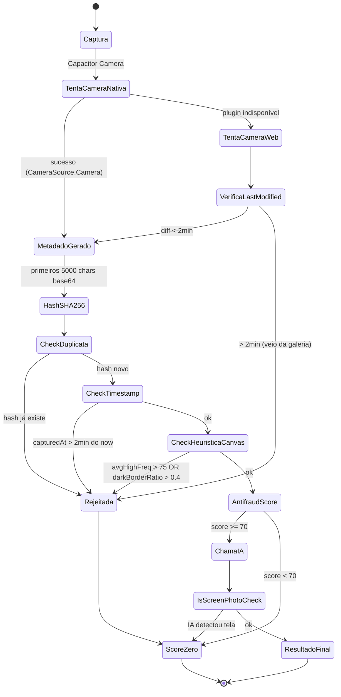

# 06 — Regras de Negócio

> Documento técnico do SaluFlow (antes VitaScore). Todo conteúdo em pt-BR.

## Sumário

1. [Princípio central: bonificação, nunca penalização](#1-princípio-central-bonificação-nunca-penalização)
2. [NR-1 e WHO-5 — risco psicossocial](#2-nr-1-e-who-5--risco-psicossocial)
3. [Scoring de refeição (0-100)](#3-scoring-de-refeição-0-100)
4. [Noom Color — densidade calórica](#4-noom-color--densidade-calórica)
5. [Dicas de equilíbrio determinísticas](#5-dicas-de-equilíbrio-determinísticas)
6. [Anti-fraude de foto](#6-anti-fraude-de-foto)
7. [Metas semanais e bônus de participação](#7-metas-semanais-e-bônus-de-participação)
8. [Biblioteca — 6 minutos de leitura/dia](#8-biblioteca--6-minutos-de-leituradia)
9. [Coparticipação (copay-discount)](#9-coparticipação-copay-discount)

---

## 1. Princípio central: bonificação, nunca penalização

Esta é a regra que precede todas as outras. Qualquer decisão de produto que viole esta seção deve ser **rejeitada**.

### 1.1 Por que não penalizar score baixo

A legislação brasileira trata dado de saúde como sensível (LGPD Art. 11) e proíbe discriminação laboral fundamentada em saúde. Especificamente:

- **CLT Art. 373-A e Art. 442** vedam tratamento diferenciado que resulte em prejuízo por condição pessoal.
- **Lei 9.029/95** (dispensa discriminatória) proíbe seleção/dispensa por motivo de saúde, gravidez, idade, raça, entre outros.
- **Convenção OIT 111** (ratificada pelo Brasil) proíbe discriminação em emprego.
- **NR-1 (redação de maio/2026)** obriga a avaliação de risco psicossocial mas **não autoriza o empregador a conhecer dados individuais** do trabalhador — a análise deve ser agregada.

Conclusão operacional: score individual **nunca** pode resultar em desconto salarial, prejuízo na avaliação de desempenho, bloqueio de promoção, exposição pública (ranking nominado) nem variação de valor em benefício. A **empresa contratante jamais vê o score individual**.

### 1.2 Por que PCD, gestantes e crônicos não podem ser prejudicados

Uma pessoa com cadeira de rodas não vai bater 8.000 passos por dia. Uma gestante no terceiro trimestre não vai correr 5km. Um diabético tipo 1 tem variações glicêmicas independentes de esforço. Se o score for baseado em **resultado absoluto**, esses públicos seriam sistematicamente desfavorecidos — o que configura discriminação direta por condição de saúde.

Solução implementada em `lib/health/weekly-goals.ts` (linhas 7-10 do cabeçalho):

```ts
/**
 * - PCD, gestantes, condicoes cronicas: metas ADAPTADAS (alvos diferentes, mesma recompensa)
 * - Metas sao SUGESTOES — sem penalidade por nao cumprir
 */
```

O campo `UserGoalProfile.adaptations: string[]` (`lib/health/weekly-goals.ts:102`) lista adaptações ativas. Os templates de metas geram alvos diferentes para quem tem `"pcd"`, `"gestante"` ou `"cronico"` no array, mas o `pointsReward` permanece o mesmo (`COINS_PER_GOAL = 50`, linha 116).

### 1.3 Apenas "bônus de participação"

Toda comunicação do app — UI, marketing, contratos com RH — deve se referir ao sistema como:

- "Bônus de participação" ✅
- "Recompensa por engajamento" ✅
- "Desconto por hábito saudável" (aceitável quando individual e privado) ✅
- "Desconto por performance" ❌ (sugere comparação)
- "Ranking de saúde" ❌ (sugere exposição)
- "Penalidade por score baixo" ❌ (ilegal)

O que é permitido: dar **mais** para quem participa. O que é proibido: dar **menos** para quem não participa (o ponto de partida é sempre igual para todos).

---

## 2. NR-1 e WHO-5 — risco psicossocial

### 2.1 Contexto regulatório

A nova redação da **NR-1** (entra em vigor em maio de 2026) obriga o empregador a incluir **riscos psicossociais** no Programa de Gerenciamento de Riscos (PGR). A multa por descumprimento é de **R$ 6.708,00 por trabalhador exposto** (valor vinculado ao TAC do MTE, reajustado).

O SaluFlow oferece o módulo de check-in semanal baseado no **WHO-5 Wellbeing Index** — instrumento da OMS, validado cientificamente, usado em ensaios clínicos para triagem de depressão e burnout.

### 2.2 Estrutura do WHO-5

Cinco perguntas, cada uma respondida em escala 0-5 (`lib/health/wellbeing-checkin.ts:70`):

```ts
export const WHO5_QUESTIONS: WellbeingQuestion[] = [
  { id: "q1", text: "Me senti animado(a) e de bom humor" },
  { id: "q2", text: "Me senti calmo(a) e tranquilo(a)" },
  { id: "q3", text: "Me senti ativo(a) e com energia" },
  { id: "q4", text: "Acordei me sentindo descansado(a)" },
  { id: "q5", text: "Meu dia tem sido interessante" },
];
```

A escala de resposta (`lib/health/wellbeing-checkin.ts:79`):

| Valor | Rótulo |
|:---:|:---|
| 0 | Em nenhum momento |
| 1 | Raramente |
| 2 | Menos da metade do tempo |
| 3 | Mais da metade do tempo |
| 4 | A maior parte do tempo |
| 5 | O tempo todo |

### 2.3 Cálculo do score (0-100)

```ts
// lib/health/wellbeing-checkin.ts:127
const rawScore = Object.values(answers).reduce((sum, v) => sum + v, 0);
const totalScore = rawScore * 4; // 0-25 → 0-100
```

Soma das 5 respostas (0-25) multiplicada por 4. O valor resultante segue as bandas recomendadas pela OMS, mapeadas em `getCategory()` (`lib/health/wellbeing-checkin.ts:96`):

| Faixa | Categoria | Cor |
|:---:|:---|:---:|
| ≥ 84 | Excelente | verde |
| 68-83 | Bom | azul |
| 52-67 | Moderado | amarelo |
| 36-51 | Baixo | laranja |
| < 36 | Crítico | vermelho |

A OMS recomenda que scores abaixo de 50 (raw ≤ 13) ou qualquer resposta individual ≤ 1 sejam tratados como sinal de alerta para avaliação clínica complementar — o app **sugere** recursos, mas nunca diagnostica.

### 2.4 Dashboard agregado para RH

O RH tem acesso apenas a dados agregados, nunca individuais. A função responsável está em `lib/health/wellbeing-checkin.ts:193`:

```ts
static async getAggregatedReport(
  totalEmployees: number,
): Promise<WellbeingAggregated>
```

O retorno contém:

- `totalResponses`, `participationRate`, `avgScore` (média global);
- `categoryDistribution` — quantos estão em cada banda (Excelente, Bom, Moderado, Baixo, Crítico);
- `weeklyAvg` — série temporal por semana;
- `trend` — melhoria/estabilidade/queda comparando últimas 2 semanas vs. 2 anteriores.

Comentário obrigatório na interface `WellbeingAggregated` (`lib/health/wellbeing-checkin.ts:66`):

```ts
// NENHUM dado individual — jamais
```

Essa restrição é estrutural: o tipo TypeScript do retorno literalmente não possui campo para dado individual, o que força erro de compilação se alguém tentar expor uma resposta nominada ao dashboard corporativo.

### 2.5 Frequência recomendada

- **Check-in semanal** — mínimo para relatório NR-1 fazer sentido.
- **Check-in quinzenal** — aceitável para times pequenos (<30 pessoas) onde cadência semanal vira pressão.
- **Check-in diário** — permitido pelo app (há `hasAnsweredToday`), mas não recomendado para a maioria dos casos porque aumenta atrito sem melhorar a qualidade do sinal.

### 2.6 Retenção local

O histórico é armazenado apenas no dispositivo do usuário, limitado a 90 dias (`lib/health/wellbeing-checkin.ts:154-157`). O agregado empresarial é calculado **em tempo real** a partir das respostas presentes em cada dispositivo quando cada usuário abre o app — o que significa que o SaluFlow, na arquitetura atual, precisa de um ponto de agregação real para gerar o relatório corporativo de verdade (há uma dívida técnica documentada: hoje o agregado é computado sobre o histórico local apenas, simulando o comportamento final).

---

## 3. Scoring de refeição (0-100)

Fórmula determinística espelhada em dois lugares (mock e `recalculateScore`), ambos em `lib/health/meal-analyzer.ts`:

- Mock inicial: `lib/health/meal-analyzer.ts:573-585`
- Recálculo após edição manual: `lib/health/meal-analyzer.ts:746-760`

### 3.1 Tabela de pontos

| Base | | **50** |
|:---|:---|---:|
| **Adições (+)** | | |
| Vegetais visíveis | `hasVegetables` | **+12** |
| Proteína magra | `hasProtein` | **+8** |
| Grão integral | `hasWholeGrains` | **+8** |
| Fruta fresca | `hasFruit` | **+5** |
| Porção adequada | `portionSize === "adequate"` | **+5** |
| Variedade alta (≥4 cores) | `colorVariety >= 4` | **+5** |
| Hidratação com água | `hydration === "water"` | **+5** |
| **Reduções (−)** | | |
| Ultraprocessado | `isProcessed` | **−15** |
| Frito por imersão | `isDeepFried` | **−12** |
| Refrigerante | `hydration === "soda"` | **−8** |
| Porção grande | `portionSize === "large"` | **−3** |
| **Clamp** | | `Math.max(0, Math.min(100, score))` |

### 3.2 Fluxograma do cálculo

```mermaid
flowchart TD
    Start([Início: score = 50]) --> V{hasVegetables?}
    V -->|sim| V1[+12]
    V -->|não| P
    V1 --> P{hasProtein?}
    P -->|sim| P1[+8]
    P -->|não| W
    P1 --> W{hasWholeGrains?}
    W -->|sim| W1[+8]
    W -->|não| F
    W1 --> F{hasFruit?}
    F -->|sim| F1[+5]
    F -->|não| IP
    F1 --> IP{isProcessed?}
    IP -->|sim| IP1[-15]
    IP -->|não| DF
    IP1 --> DF{isDeepFried?}
    DF -->|sim| DF1[-12]
    DF -->|não| PS
    DF1 --> PS{portionSize}
    PS -->|adequate| PS1[+5]
    PS -->|large| PS2[-3]
    PS -->|small| CV
    PS1 --> CV{colorVariety ≥ 4?}
    PS2 --> CV
    CV -->|sim| CV1[+5]
    CV -->|não| H
    CV1 --> H{hydration}
    H -->|water| H1[+5]
    H -->|soda| H2[-8]
    H -->|outro| Clamp
    H1 --> Clamp[Clamp 0-100]
    H2 --> Clamp
    Clamp --> End([score final])

    style Start fill:#E8F0FE
    style End fill:#E6F4EA
    style IP1 fill:#FCE8E6
    style DF1 fill:#FCE8E6
    style H2 fill:#FCE8E6
```



### 3.3 Observações

- **Idempotência**: a fórmula é totalmente determinística, o que permite ao app recalcular o score quando o usuário edita flags manualmente em `MealAnalyzer.updateMeal()` (`lib/health/meal-analyzer.ts:683`). A edição marca `editedByUser: true` no registro para rastreio.
- **Mock vs IA real**: quando o provedor de IA está configurado, o `mealScore` vem do modelo (prompt em `lib/ai/meal-ai.ts:165`) e a fórmula local só é usada no fallback mock e no recálculo. O prompt do modelo pede explicitamente um score de 0-100 seguindo as mesmas diretrizes, garantindo consistência entre as duas fontes.
- **Empate entre IA e regra**: se o `aiResult.mealScore` ficar muito distante do que a fórmula local produziria com os mesmos flags, é sinal de que o prompt precisa de calibração — hoje não há detecção automática dessa divergência (dívida técnica).

---

## 4. Noom Color — densidade calórica

O SaluFlow complementa o score nutricional (0-100) com o sistema de cores do Noom, que avalia **densidade calórica** em kcal/g. Os dois são ortogonais — uma refeição pode ter score alto e cor laranja (saudável mas calórica: castanhas, abacate, azeite), e vice-versa.

### 4.1 Faixas (`CaloricDensity` em `lib/health/meal-analyzer.ts:85`)

| Cor | Faixa | Exemplos |
|:---:|:---|:---|
| 🟢 **Verde** | < 1,0 kcal/g | vegetais, frutas frescas, sopas claras, iogurte desnatado |
| 🟡 **Amarelo** | 1,0 – 2,4 kcal/g | arroz, massas, carnes magras, pães, leguminosas |
| 🟠 **Laranja** | > 2,4 kcal/g | frituras, queijos gordos, doces, castanhas, ultraprocessados |

Uma quarta categoria, `"unknown"`, é usada quando a IA não consegue estimar com confiança razoável (e o score nutricional cai junto).

### 4.2 Ortogonalidade com o score

O Noom Color **não** entra no cálculo do `mealScore`. Eles são apresentados lado a lado na UI para que o usuário entenda duas dimensões independentes:

- **Score nutricional**: qualidade da composição (tem vegetal? tem proteína? é frito?).
- **Densidade calórica**: quanto aquele volume representa de energia (para quem está em déficit calórico).

Essa separação é intencional: quem precisa ganhar peso (baixo peso, alta demanda energética) pode buscar laranjas de boa qualidade (castanhas, azeite); quem está em déficit foca em verdes independente do score.

---

## 5. Dicas de equilíbrio determinísticas

Arquivo: `lib/health/meal-tips.ts`.

Após cada análise de refeição, o app gera **dicas acionáveis** para equilibrar a refeição — totalmente client-side, **zero custo de token** de IA. A lógica inspeciona flags faltantes na análise e emite sugestões correspondentes.

### 5.1 Tabela de flags → dicas

| Condição | Dica | `scoreGain` |
|:---|:---|---:|
| `!hasVegetables` | "Adicione salada verde, legumes ou verduras" | **+12** |
| `!hasProtein` | "Inclua fonte de proteína magra (ovo, frango, peixe, feijão)" | **+10** |
| `!hasWholeGrains && !hasFruit` | "Troque o carboidrato por versão integral" | **+8** |
| `isDeepFried` | "Prefira grelhado, assado ou cozido" | **+10** |
| `isProcessed` | "Substitua o molho industrializado por tempero caseiro" | **+10** |
| `portionSize === "large"` | "Reduza a porção — prato menor ajusta a saciedade" | **+4** |
| `hydration === "soda"` | "Troque refrigerante por água ou suco natural" | **+8** |
| `hydration === "juice"` | "Prefira água ao suco" | **+4** |
| `hydration === "unknown"/"none"` | "Beba água junto com a refeição" | **+3** |

### 5.2 Projeção "score atual → score projetado"

```ts
// lib/health/meal-tips.ts:107
const totalGain = tips.reduce((sum, t) => sum + t.scoreGain, 0);
const projectedScore = Math.min(95, analysis.mealScore + totalGain);
```

O app mostra ao usuário: "sua refeição atual é 58 → aplicando essas dicas chegaria a 82". O teto de **95** (não 100) é intencional — evita prometer perfeição e preserva espaço para ganhos futuros (variação, regularidade). A função `getEncouragement()` (`lib/health/meal-tips.ts:113`) emite mensagens motivacionais em faixas:

- ≥ 85: "Refeição excelente!"
- ≥ 70: "Boa refeição. Pequenos ajustes podem melhorar ainda mais."
- ≥ 50: "Refeição mediana. Dá pra equilibrar melhor."
- ≥ 30: "Refeição desequilibrada."
- < 30: "Essa refeição pode ser melhorada bastante."

---

## 6. Anti-fraude de foto

Arquivo principal: `lib/health/meal-analyzer.ts`. Cabeçalho com os 6 vetores de defesa em `lib/health/meal-analyzer.ts:3-11`.

### 6.1 Diagrama de estado da captura



### 6.2 Camera-only (galeria bloqueada)

Duas estratégias em sequência (`lib/health/meal-analyzer.ts:204-278`):

1. **Capacitor Camera nativo** com `source: CameraSource.Camera` — bloqueia galeria no nível do OS (linha 211).
2. **Fallback web** via `<input type="file" accept="image/*" capture="environment">` — força câmera traseira no Android (linha 229). Depois valida `file.lastModified` contra `Date.now()` — se `timeDiff > 120000` (2 minutos), assume que veio da galeria e rejeita (linha 242).

### 6.3 Hash SHA-256 dos primeiros 5000 chars

```ts
// lib/health/meal-analyzer.ts:307
const photoHash = await generateHash(photoBase64.slice(0, 5000));
```

Por que **5000 chars, não a imagem inteira**: performance. Em dispositivos low-end, computar SHA-256 de uma base64 de 800kb trava o Webview por segundos. Os primeiros 5000 caracteres (~3,75kb de dados reais) capturam o cabeçalho JPEG e os primeiros blocos DCT — suficiente para detectar reutilização da mesma foto. Duas fotos diferentes do mesmo prato terão hashes distintos porque o JPEG encoder introduz ruído; uma mesma foto reenviada terá o mesmo hash.

A lista de hashes usados é mantida em `"photo-hashes"` com limite de 500 entradas circulares (`lib/health/meal-analyzer.ts:314-317`).

### 6.4 GPS opcional — não dispara permissão

```ts
// lib/health/meal-analyzer.ts:163
async function getLocation(): Promise<{ lat: number; lng: number } | null> {
  // GPS é opcional (só anti-fraude). Só pega se a permissão JÁ estiver
  // concedida — nunca dispara o diálogo de permissão aqui...
```

Decisão explícita: a função **checa** `Geolocation.checkPermissions()` antes e retorna `null` silenciosamente se a permissão não estiver concedida, para não conflitar com o diálogo nativo da câmera (mostrar dois diálogos sequenciais tem altíssima taxa de recusa). GPS é bônus anti-fraude, não requisito.

### 6.5 Detecção de foto-de-tela

Dois mecanismos complementares:

**Heurística local** (`lib/health/meal-analyzer.ts:354`, função `detectRealPhoto`): redimensiona a imagem para 100×100 no canvas, calcula variância de alta frequência (Laplacian simplificado) e detecta bordas escuras (indicador de foto de tela de celular). Thresholds empíricos: `avgHighFreq > 75` ou `darkBorderRatio > 0.4` → rejeita.

**IA** (`lib/health/meal-analyzer.ts:521`): quando o provedor de IA está ativo, o próprio modelo de visão retorna um campo `isScreenPhoto` (prompt em `lib/ai/meal-ai.ts:188`). Se `true`, o app força `antifraud.passed = false` e zera o score, mesmo que a heurística local tenha passado.

### 6.6 Score anti-fraude e reprovação

```ts
// lib/health/meal-analyzer.ts:323-336
let score = 0;
if (isCameraPhoto) score += 25;
if (isTimestampFresh) score += 25;
if (isNotScreenPhoto) score += 20;
if (isNotDuplicate) score += 20;
if (hasLocation) score += 10;
return {
  passed: score >= 70 && flags.length <= 1,
  ...
};
```

Se `antifraud.passed === false`, o `analyzePhoto()` retorna um resultado com `mealScore: 0` e descrição "Foto rejeitada pela verificação anti-fraude: ..." (linha 507). Nenhum ponto é concedido — mas o usuário vê exatamente quais checks falharam, para que saiba o que corrigir.

---

## 7. Metas semanais e bônus de participação

Arquivo: `lib/health/weekly-goals.ts`.

### 7.1 Modelo de engajamento

Inspirado no sistema Prudential Vitality, mas adaptado para conformidade trabalhista brasileira:

```ts
// lib/health/weekly-goals.ts:116-119
const COINS_PER_GOAL = 50;
const GOALS_PER_WEEK = 3;
const ALL_COMPLETED_BONUS = 30;
const MAX_COINS_PER_WEEK = GOALS_PER_WEEK * COINS_PER_GOAL + ALL_COMPLETED_BONUS; // 180
```

- 3 metas por semana, geradas por `WeeklyGoals.generateWeekGoals()` (`lib/health/weekly-goals.ts:473`).
- Cada meta cumprida vale **50 moedas** (iguais para todos).
- Bônus de **30 moedas** se todas as 3 forem completadas (total máximo semanal = 180).

### 7.2 Seleção rotativa de categorias

`selectCategories()` (`lib/health/weekly-goals.ts:442`) garante uma categoria "universal" (wellbeing ou nutrition — acessíveis a 100% da população, inclusive PCD e gestantes) a cada semana, e rotaciona as outras duas entre movement, sleep, nutrition, wellbeing, digital. Isso evita semanas inteiras com metas físicas que excluiriam usuários com restrições.

### 7.3 Adaptações universais

O campo `profile.adaptations: string[]` modifica os templates. Por exemplo, um template de movement que geraria "8000 passos em 5 dias" para o perfil default gera "300 minutos de atividade leve" para um perfil com `"pcd"`. O `pointsReward` permanece **50** nos dois casos. Isso é a implementação técnica do "bônus de participação" — o esforço relativo é equivalente, a recompensa é igual.

### 7.4 Streak

`CoinBalance.streak` (`lib/health/weekly-goals.ts:79`) rastreia dias consecutivos com interação no app. O streak é pessoal (não é comparado com colegas) e não afeta a coparticipação; serve apenas como mecanismo de hábito individual. Quebras de streak **não penalizam** — apenas zeram o contador para começar de novo.

### 7.5 Metas são sugestões, não contratos

Ponto crítico: se o usuário não cumprir uma meta, **nada acontece**. O score global e o desconto de coparticipação continuam iguais — ele apenas não recebe o incremento daquela semana. Essa característica é o que permite chamar o sistema de "bônus de participação" em vez de "cobrança por performance".

---

## 8. Biblioteca — 6 minutos de leitura/dia

Arquivo: `lib/library/books.ts`.

### 8.1 Base científica

Estudo da **University of Sussex (2009)** (Dr. David Lewis): 6 minutos de leitura reduzem o nível de estresse em **68%**, mais que caminhar (42%), ouvir música (61%) ou tomar chá/café (54%). A frequência cardíaca cai e a tensão muscular diminui após apenas 6 minutos.

### 8.2 Curadoria de domínio público

O app distribui **50+ obras literárias** de domínio público (autor falecido há 70+ anos), todas com links para Wikisource ou Project Gutenberg. Nenhum direito autoral envolvido, zero custo de licenciamento.

Estrutura do tipo `Book` (`lib/library/books.ts:26`):

```ts
export interface Book {
  id: string;
  title: string;
  author: string;
  year: number;
  nationality: "br" | "pt" | "int";
  category: BookCategory;   // romance-br, conto, poesia, historia, filosofia, aventura...
  era: BookEra;             // romantismo, realismo, pre-modernismo, classico-int
  description: string;
  estimatedReadTime: number; // minutos para ~20 páginas
  cover: string;             // emoji
  color: string;             // hex
  sourceUrl: string;         // Wikisource
  pages: number;
}
```

Exemplos no catálogo: Dom Casmurro (Machado), O Cortiço (Aluísio Azevedo), Memórias Póstumas de Brás Cubas, contos de Machado, poesia parnasiana, clássicos internacionais em tradução de domínio público.

### 8.3 Status de leitura

Cada livro tem status por usuário, persistido localmente:

- `lendo` — em progresso ativo
- `lido` — concluído
- `quero-ler` — wishlist
- `pausado` — temporariamente parado

A alternância de status gera entradas em streak de leitura e pode cumprir metas de wellbeing na rotação semanal (categoria universal).

### 8.4 Meta diária padrão

6 minutos/dia — curto o suficiente para ninguém justificar "não tenho tempo", longo o suficiente para o efeito medido do Sussex. O app propõe isso como sugestão, não como obrigação, e conta como "check-in de wellbeing" para as metas semanais.

---

## 9. Coparticipação (copay-discount)

Arquivo: `lib/health/copay-discount.ts`.

Este módulo conecta o score do usuário (0-1000 no sistema interno) a descontos de coparticipação em procedimentos do plano de saúde. **Atenção**: o desconto é o incentivo positivo — ninguém paga mais do que o copay base. A tabela atua como **bônus de participação** aplicado sobre o copay cheio.

### 9.1 Tiers (`lib/health/copay-discount.ts:29`)

| Tier | Faixa de score | Desconto | Cor |
|:---:|:---:|:---:|:---:|
| Platina | 850-1000 | **30%** | azul |
| Ouro | 600-849 | **20%** | amarelo |
| Prata | 300-599 | **10%** | cinza |
| Bronze | 0-299 | **0%** | (neutro) |

### 9.2 Leitura correta da tabela

Bronze tem **0% de desconto**, não "multa 30%". O ponto de partida é sempre o copay cheio contratual — usuários que não participam pagam o valor padrão, usuários que participam pagam menos. Isso é o que torna a política legalmente defensável frente à Lei 9.029/95 e à LGPD Art. 11.

### 9.3 Simulação de procedimentos

`CopayCalculator.simulateProcedures()` (`lib/health/copay-discount.ts:63`) aplica o desconto do tier atual sobre uma lista de procedimentos de referência:

```ts
// lib/health/copay-discount.ts:36
const COMMON_PROCEDURES = [
  { name: "Consulta médica", copay: 50 },
  { name: "Exame de sangue", copay: 30 },
  { name: "Raio-X", copay: 45 },
  { name: "Ultrassom", copay: 80 },
  { name: "Ressonância magnética", copay: 200 },
  { name: "Fisioterapia (sessão)", copay: 40 },
  { name: "Consulta psicólogo", copay: 60 },
];
```

O retorno mostra `originalCopay`, `discountAmount`, `finalCopay` — permitindo que o usuário visualize economia concreta ("sua ressonância custaria R$ 200, com seu tier Ouro fica R$ 160").

### 9.4 Projeção anual

`getAnnualSavingsEstimate()` (`lib/health/copay-discount.ts:112`) calcula economia anual assumindo 2 procedimentos/mês (valor padrão configurável). É mostrada como motivador de engajamento de longo prazo — o usuário vê que manter tier Ouro por 12 meses economiza um valor concreto em reais.

### 9.5 Limitação regulatória importante

A RN 498/499 da ANS regula coparticipação em planos de saúde com regras específicas — o SaluFlow só pode aplicar esses descontos em **operadoras parceiras** que já tenham o produto aprovado. O módulo existe como simulador e como API pronta para integração; a ativação real do desconto exige contrato entre SaluFlow, operadora e empregador.

---

**Arquivos relevantes:**
- `lib/health/meal-analyzer.ts` — scoring, anti-fraude, captura
- `lib/health/meal-tips.ts` — dicas determinísticas
- `lib/health/wellbeing-checkin.ts` — WHO-5 e agregado NR-1
- `lib/health/weekly-goals.ts` — bônus de participação
- `lib/health/copay-discount.ts` — tiers de coparticipação
- `lib/library/books.ts` — catálogo de leitura
- `lib/ai/meal-ai.ts` — prompt e integração de visão
