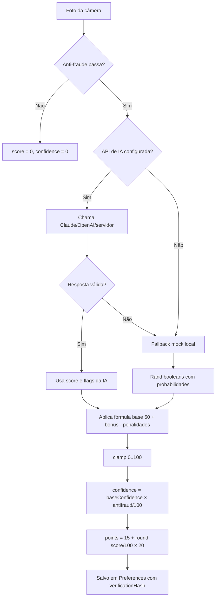

# 12. Fórmulas e Algoritmos — SaluFlow

## Sumário

- [Visão geral](#visão-geral)
- [1. Scoring de Refeição](#1-scoring-de-refeição)
  - [1.1 Score base da refeição (mock / recalculateScore)](#11-score-base-da-refeição-mock--recalculatescore)
  - [1.2 Pontuação do usuário por refeição](#12-pontuação-do-usuário-por-refeição)
  - [1.3 Relatório diário de nutrição](#13-relatório-diário-de-nutrição)
  - [1.4 Regularidade das refeições](#14-regularidade-das-refeições)
  - [1.5 Variedade](#15-variedade)
  - [1.6 Fluxograma do scoring](#16-fluxograma-do-scoring)
- [2. Dicas de Equilíbrio e Projeção](#2-dicas-de-equilíbrio-e-projeção)
- [3. WHO-5 Wellbeing Check-in](#3-who-5-wellbeing-check-in)
- [4. Metas Semanais](#4-metas-semanais)
- [5. Peso, IMC e Tendência](#5-peso-imc-e-tendência)
- [6. Confiança da Análise](#6-confiança-da-análise)
- [7. Hash Anti-Fraude](#7-hash-anti-fraude)
- [8. Densidade Calórica Mock](#8-densidade-calórica-mock)
- [9. Coparticipação — Desconto por Tier](#9-coparticipação--desconto-por-tier)

---

## Visão geral

Este documento inventaria todas as fórmulas e algoritmos determinísticos do SaluFlow. Cada cálculo abaixo foi extraído diretamente do código-fonte (com referência de arquivo e linha). A maioria roda 100% client-side — apenas a análise de foto de refeição chama uma API externa, e ainda assim com fallback local.

A filosofia de scoring do app é: **todas as pontuações são limitadas a faixas pequenas (0-100 para score, 0-30 para pontos por categoria), determinísticas quando possível, com clamps defensivos em todas as bordas** (`Math.max(0, Math.min(100, x))`). Isso evita que edge cases quebrem a UI.

---

## 1. Scoring de Refeição

### 1.1 Score base da refeição (mock / recalculateScore)

**Arquivo:** `lib/health/meal-analyzer.ts:573-585` (função anônima no fallback mock) e `lib/health/meal-analyzer.ts:746-760` (`recalculateScore`)

**Descrição:** calcula o `mealScore` (0-100) a partir dos flags booleanos detectados pela IA (ou mockados no fallback). Este é o mesmo cálculo usado em duas situações: (a) quando não há provider de IA configurado, o app roda o mock local; (b) quando o usuário edita manualmente os flags de uma refeição já salva, o score é recalculado para manter consistência com as novas escolhas.

**Fórmula:**

```
score = 50
      + (hasVegetables   ? +12 : 0)
      + (hasProtein      ?  +8 : 0)
      + (hasWholeGrains  ?  +8 : 0)
      + (hasFruit        ?  +5 : 0)
      + (isProcessed     ? -15 : 0)
      + (isDeepFried     ? -12 : 0)
      + (portionSize == "adequate" ?  +5 : 0)
      + (portionSize == "large"    ?  -3 : 0)
      + (colorVariety >= 4 ?  +5 : 0)
      + (hydration == "water" ?  +5 : 0)
      + (hydration == "soda"  ?  -8 : 0)

score = clamp(0, 100, score)    // sempre dentro de 0..100
```

**Snippet (fallback mock):**

```typescript
let score = 50;
if (hasVegetables) score += 12;
if (hasProtein) score += 8;
if (hasWholeGrains) score += 8;
if (hasFruit) score += 5;
if (isProcessed) score -= 15;
if (isDeepFried) score -= 12;
if (portionSize === "adequate") score += 5;
if (portionSize === "large") score -= 3;
if (colorVariety >= 4) score += 5;
if (hydration === "water") score += 5;
if (hydration === "soda") score -= 8;
score = Math.max(0, Math.min(100, score + rand(-5, 5)));
```

**Snippet (`recalculateScore`, usado em edição manual):**

```typescript
private static recalculateScore(a: MealPhotoAnalysis): number {
  let score = 50;
  if (a.hasVegetables) score += 12;
  if (a.hasProtein) score += 8;
  if (a.hasWholeGrains) score += 8;
  if (a.hasFruit) score += 5;
  if (a.isProcessed) score -= 15;
  if (a.isDeepFried) score -= 12;
  if (a.portionSize === "adequate") score += 5;
  if (a.portionSize === "large") score -= 3;
  if (a.colorVariety >= 4) score += 5;
  if (a.hydration === "water") score += 5;
  if (a.hydration === "soda") score -= 8;
  return Math.max(0, Math.min(100, score));
}
```

**Inputs:** flags booleanos (`hasVegetables`, `hasProtein`, `hasWholeGrains`, `hasFruit`, `isProcessed`, `isDeepFried`), `portionSize` (`"small" | "adequate" | "large"`), `colorVariety` (1-5), `hydration` (`"water" | "juice" | "soda" | "none" | "unknown"`).

**Output:** `number` no intervalo `[0, 100]`.

**Edge cases:**
- O mock adiciona um ruído `rand(-5, 5)` para simular variação humana, clamped pelo `Math.max/Math.min` nas bordas.
- `recalculateScore` não tem ruído aleatório — é 100% determinístico, o que é intencional para manter consistência na edição.
- Range máximo teórico (todos os bonus, nenhuma penalidade): `50 + 12 + 8 + 8 + 5 + 5 + 5 + 5 = 98`. O valor 100 só é atingível pela IA externa (não pelo cálculo local).
- Range mínimo teórico: `50 - 15 - 12 - 3 - 8 = 12`, depois clampado a 0 pelo `Math.max`.

**Usado em:** tela de captura de refeição, edição manual de refeição (`MealAnalyzer.updateMeal`), dashboard nutricional e no cálculo da projeção de score em `lib/health/meal-tips.ts`.

---

### 1.2 Pontuação do usuário por refeição

**Arquivo:** `lib/health/meal-analyzer.ts:721` (dentro de `updateMeal`)

**Descrição:** converte o `mealScore` (0-100) em pontos ganhos pelo usuário (15-35). Todo mundo ganha os 15 pontos de base por registrar a refeição; o bônus de até 20 pontos é proporcional ao score.

**Fórmula:**

```
points = 15 + round((mealScore / 100) × 20)
```

**Snippet:**

```typescript
points:
  newAnalysis && newAnalysis !== current.analysis
    ? 15 + Math.round((newAnalysis.mealScore / 100) * 20)
    : current.points,
```

**Inputs:** `mealScore` (0-100).
**Output:** inteiro em `[15, 35]`.
**Edge cases:** nunca é zero — só registrar já garante 15 pontos. Isso é decisão de produto (reforço positivo).

**Usado em:** histórico de refeições, saldo diário, gamificação.

---

### 1.3 Relatório diário de nutrição

**Arquivo:** `lib/health/meal-analyzer.ts:768-790` (`getTodayReport`)

**Descrição:** agrega todas as refeições do dia em um relatório com média de score, pontuação total e label de confiança (quantas foram verificadas por foto).

**Fórmula:**

```
avgMealScore     = round(Σ mealScore / nº refeições analisadas)
totalMealPoints  = Σ points
regularityScore  = calculateRegularity(meals)         // 0-30
varietyScore     = min(15, mealCount*3 + photoVerifiedCount*2)
totalPoints      = min(150, totalMealPoints + regularityScore + varietyScore)
```

**Snippet:**

```typescript
const totalMealPoints = meals.reduce((sum, m) => sum + m.points, 0);
const avgMealScore = analyzed.length > 0
  ? Math.round(analyzed.reduce((sum, m) => sum + (m.analysis?.mealScore ?? 0), 0) / analyzed.length)
  : 0;

const regularityScore = this.calculateRegularity(meals);
const varietyScore = Math.min(15, mealCount * 3 + photoVerifiedCount * 2);
const totalPoints = Math.min(150, totalMealPoints + regularityScore + varietyScore);
```

**Inputs:** array de `VerifiedMeal` do dia.
**Output:** objeto `DailyNutritionReport` com `totalPoints` em `[0, 150]`.
**Edge cases:** se `analyzed.length === 0` (sem refeições analisadas por IA), `avgMealScore = 0`. O teto de 150 evita que um usuário "farme" pontos registrando 20 refeições no mesmo dia.

**Usado em:** dashboard de nutrição, cálculo do SaluScore global.

---

### 1.4 Regularidade das refeições

**Arquivo:** `lib/health/meal-analyzer.ts:792-801` (`calculateRegularity`)

**Descrição:** dá pontos extras quando a refeição é feita na janela de horário "normal" para aquele tipo (café 6h-10h, almoço 11h-14h, jantar 18h-22h, lanche qualquer hora).

**Fórmula:**

```
para cada refeição:
  se hora ∈ janela(tipo): score += 10
  senão:                  score += 3
regularityScore = min(30, score)
```

**Snippet:**

```typescript
private static calculateRegularity(meals: VerifiedMeal[]): number {
  let score = 0;
  const windows: Record<string, [number, number]> = {
    cafe: [6, 10], almoco: [11, 14], jantar: [18, 22], lanche: [0, 23],
  };
  for (const meal of meals) {
    const hour = new Date(meal.timestamp).getHours();
    const [start, end] = windows[meal.type] ?? [0, 23];
    score += (hour >= start && hour <= end) ? 10 : 3;
  }
  return Math.min(30, score);
}
```

**Inputs:** array de refeições (cada uma com `timestamp` e `type`).
**Output:** `[0, 30]`.
**Edge cases:** lanche sempre ganha 10 (janela 0-23). Tipos desconhecidos caem na janela 0-23 (também sempre dentro).

**Usado em:** cálculo do `DailyNutritionReport.regularityScore`.

---

### 1.5 Variedade

**Arquivo:** `lib/health/meal-analyzer.ts:780` (dentro de `getTodayReport`)

**Descrição:** premia quem registra várias refeições no mesmo dia, com bônus extra para refeições verificadas por foto (mais confiáveis).

**Fórmula:**

```
varietyScore = min(15, mealCount × 3 + photoVerifiedCount × 2)
```

**Snippet:**

```typescript
const varietyScore = Math.min(15, mealCount * 3 + photoVerifiedCount * 2);
```

**Inputs:** `mealCount` (inteiro ≥0), `photoVerifiedCount` (inteiro ≥0, ≤ `mealCount`).
**Output:** `[0, 15]`.
**Edge cases:** máximo teórico atingido com 3 refeições, todas fotografadas (`3*3 + 3*2 = 15`).

**Usado em:** `DailyNutritionReport.varietyScore`.

---

### 1.6 Fluxograma do scoring



---

## 2. Dicas de Equilíbrio e Projeção

**Arquivo:** `lib/health/meal-tips.ts:19-111` (`generateBalanceTips`)

**Descrição:** gera dicas determinísticas para equilibrar a refeição e calcula o score projetado caso o usuário siga todas. Zero custo de token — roda 100% client-side.

**Fórmula:**

```
tips = []
se !hasVegetables     → +12 pontos (plus salada)
se !hasProtein        → +10 pontos (plus proteína)
se !hasWholeGrains && !hasFruit → +8 pontos (swap integral)
se isDeepFried        → +10 pontos (swap grelhado)
se isProcessed        → +10 pontos (swap caseiro)
se portionSize=="large" → +4 pontos (reduzir porção)
se hydration=="soda"    → +8 pontos (trocar por água)
se hydration=="juice"   → +4 pontos (preferir água)
se hydration∈{none,unknown} → +3 pontos (beber água)

totalGain       = Σ scoreGain
projectedScore  = min(95, mealScore + totalGain)
```

**Snippet:**

```typescript
const totalGain = tips.reduce((sum, t) => sum + t.scoreGain, 0);
const projectedScore = Math.min(95, analysis.mealScore + totalGain);

return { tips, projectedScore };
```

**Inputs:** `MealPhotoAnalysis` com `mealScore` e flags.
**Output:** `{ tips: BalanceTip[], projectedScore: number }` — `projectedScore` no range `[0, 95]`.
**Edge cases:** o teto é 95 (não 100) intencionalmente — nunca prometer "nota máxima". Se não houver dicas aplicáveis, `projectedScore = mealScore`.

**Usado em:** card de dicas na tela de resultado da análise de refeição, feedback ao usuário após editar uma refeição.

---

## 3. WHO-5 Wellbeing Check-in

**Arquivo:** `lib/health/wellbeing-checkin.ts:126-130` (`saveResponse`) e `lib/health/wellbeing-checkin.ts:96-102` (`getCategory`)

**Descrição:** implementa o WHO-5 Wellbeing Index, instrumento validado pela OMS. São 5 perguntas respondidas em escala de 0-5. O score bruto (0-25) é multiplicado por 4 para normalizar em 0-100.

**Fórmula:**

```
rawScore     = Σ resposta_i       // 0..25
totalScore   = rawScore × 4       // 0..100

categoria:
  ≥ 84 → "Excelente"  (verde   #34A853)
  ≥ 68 → "Bom"        (azul    #1A73E8)
  ≥ 52 → "Moderado"   (amarelo #FBBC04)
  ≥ 36 → "Baixo"      (laranja #FF9F0A)
  <  36 → "Crítico"   (vermelho #EA4335)
```

**Snippet:**

```typescript
static async saveResponse(
  answers: Record<string, number>,
): Promise<WellbeingResponse> {
  const rawScore = Object.values(answers).reduce((sum, v) => sum + v, 0);
  const totalScore = rawScore * 4; // 0-25 → 0-100
  const { category, label, color } = getCategory(totalScore);
  // ...
}

function getCategory(score: number): CategoryInfo {
  if (score >= 84) return { category: "excellent", label: "Excelente", color: "#34A853" };
  if (score >= 68) return { category: "good", label: "Bom", color: "#1A73E8" };
  if (score >= 52) return { category: "moderate", label: "Moderado", color: "#FBBC04" };
  if (score >= 36) return { category: "low", label: "Baixo", color: "#FF9F0A" };
  return { category: "critical", label: "Crítico", color: "#EA4335" };
}
```

**Inputs:** 5 respostas numéricas (0-5 cada).
**Output:** `totalScore` em `[0, 100]` + categoria.
**Edge cases:** respostas faltantes não são validadas explicitamente — o usuário precisa preencher as 5 antes de submeter (validado na UI). Score exatamente 84 cai em "Excelente" (borda inclusiva).

**Cálculo de tendência** (`calculateTrend`, linha 268):

```
recentAvg = média das últimas 2 semanas
prevAvg   = média das 2 semanas anteriores
diff      = recentAvg - prevAvg

diff >  5  → "improving"
diff < -5  → "declining"
senão       → "stable"
```

**Usado em:** tela de check-in diário, histórico de bem-estar, relatório agregado para RH (respeitando k-anonimato).

---

## 4. Metas Semanais

**Arquivo:** `lib/health/weekly-goals.ts:116-119`, `lib/health/weekly-goals.ts:537-563` (`updateGoalProgress`), `lib/health/weekly-goals.ts:655-682` (`_addCoins`)

**Descrição:** motor de engajamento estilo Prudential Vitality. Cada semana o usuário recebe 3 metas personalizadas ao seu histórico. A pontuação é por participação, não por resultado absoluto.

**Constantes:**

```typescript
const COINS_PER_GOAL = 50;
const GOALS_PER_WEEK = 3;
const ALL_COMPLETED_BONUS = 30;
const MAX_COINS_PER_WEEK = GOALS_PER_WEEK * COINS_PER_GOAL + ALL_COMPLETED_BONUS; // 180
```

**Fórmula de pontuação semanal:**

```
totalCoins =
    50 × nº metas cumpridas
  + (se as 3 metas foram cumpridas: +30 de bônus)

máximo = 3 × 50 + 30 = 180 moedas/semana
```

**Snippet (`updateGoalProgress`):**

```typescript
if (!goal.completed && current >= goal.target) {
  goal.completed = true;
  plan.completedCount += 1;
  plan.totalCoins += COINS_PER_GOAL;   // +50
  await WeeklyGoals._addCoins(COINS_PER_GOAL, "Meta concluida: " + goal.title);

  if (plan.completedCount === GOALS_PER_WEEK) {
    plan.allCompleted = true;
    plan.totalCoins += ALL_COMPLETED_BONUS;   // +30 bônus
    await WeeklyGoals._addCoins(ALL_COMPLETED_BONUS, "Bonus: todas as metas da semana!");
  }
}
```

**Streak (semanas consecutivas com pelo menos 1 meta concluída):**

**Snippet (`_addCoins`, linha 670-679):**

```typescript
const hist: WeekHistory[] = (await getStore(STORE_KEYS.WEEK_HISTORY)) || [];
let streak = 0;
for (let i = hist.length - 1; i >= 0; i--) {
  if (hist[i].goalsCompleted > 0) {
    streak++;
  } else {
    break;
  }
}
balance.streak = Math.max(streak, 1);
```

**Inputs:** histórico de semanas salvo em `Capacitor Preferences`.
**Output:** `totalCoins` 0-180 por semana, `streak` ≥ 1.
**Edge cases:** `streak` nunca é 0 após o primeiro ganho (garantido por `Math.max(streak, 1)`). A contagem quebra assim que há uma semana com 0 metas concluídas.

**Personalização das metas por perfil** (`getMovementTemplates`, linha 247):

```typescript
const stepsTarget = roundToNearest(Math.max(profile.avgDailySteps * 1.1, 2000), 500);
```

A meta de passos é 110% da média atual do usuário (nunca menos que 2000), arredondada para o múltiplo de 500 mais próximo. Isso garante desafio progressivo sem ser impossível.

**Usado em:** tela de metas semanais, saldo de moedas, histórico.

---

## 5. Peso, IMC e Tendência

### 5.1 Cálculo de IMC

**Arquivo:** `lib/health/weight-monitor.ts:680-684` (`calculateBmi`)

**Fórmula:**

```
IMC = peso_kg / (altura_m)²
    = peso_kg / ((altura_cm / 100)²)
```

**Snippet:**

```typescript
static calculateBmi(weightKg: number, heightCm: number): number {
  if (heightCm <= 0) return 0;
  const heightM = heightCm / 100;
  return Math.round((weightKg / (heightM * heightM)) * 10) / 10;
}
```

**Inputs:** `weightKg` (30-300), `heightCm` (100-250 típico).
**Output:** IMC com 1 casa decimal.
**Edge cases:** `heightCm <= 0` retorna 0 (evita divisão por zero).

### 5.2 Classificação do IMC

**Arquivo:** `lib/health/weight-monitor.ts:526-542`

```
IMC < 18.5  → "Abaixo do peso" (laranja #FF9F0A)
IMC < 25    → "Normal"          (verde   #30D158)
IMC < 30    → "Sobrepeso"       (laranja #FF9F0A)
IMC ≥ 30    → "Obesidade"       (vermelho #FF453A)
```

### 5.3 Tendência de peso (kg/semana)

**Arquivo:** `lib/health/weight-monitor.ts:549-595`

**Fórmula (≥ 4 entradas):**

```
avgRecent = média das 2 últimas pesagens
avgPrev   = média das 2 pesagens anteriores
weeks     = max(1, (t_recent - t_prev) / 7 dias)
trendKgPerWeek = round(((avgRecent - avgPrev) / weeks) × 10) / 10

trendKgPerWeek < -0.2 → "losing"
trendKgPerWeek >  0.2 → "gaining"
senão                  → "stable"
```

**Snippet:**

```typescript
const recent2 = entries.slice(-2);
const prev2 = entries.slice(-4, -2);
const avgRecent = recent2.reduce((s, e) => s + e.weightKg, 0) / recent2.length;
const avgPrev = prev2.reduce((s, e) => s + e.weightKg, 0) / prev2.length;

const recentTime = new Date(recent2[0].timestamp).getTime();
const prevTime = new Date(prev2[0].timestamp).getTime();
const weeks = Math.max(1, (recentTime - prevTime) / (7 * 24 * 60 * 60 * 1000));
trendKgPerWeek = Math.round(((avgRecent - avgPrev) / weeks) * 10) / 10;
```

### 5.4 Consistência de pesagem (0-30 pontos)

**Arquivo:** `lib/health/weight-monitor.ts:620-639`

**Fórmula:**

```
weeksWithEntry = nº de semanas nas últimas 4 com ao menos 1 pesagem
consistencyScore = { 4: 30, 3: 22, 2: 15, 1: 7, 0: 0 }[weeksWithEntry]
```

### 5.5 Pontuação total do monitor de peso (0-30)

**Arquivo:** `lib/health/weight-monitor.ts:642-659`

**Fórmula:**

```
bmiPoints =
  10 se IMC normal
   5 se IMC overweight ou underweight
   0 se IMC obese

trendPoints =
  10 se (IMC normal e trend "stable")
  10 se (IMC overweight e trend "losing")
  10 se (IMC underweight e trend "gaining")
   5 se trend "stable" em outro caso
   0 caso contrário

consistencyPts = round((consistencyScore / 30) × 10)

totalPoints = min(30, bmiPoints + trendPoints + consistencyPts)
```

**Snippet:**

```typescript
let bmiPoints = 0;
if (bmiCategory === "normal") bmiPoints = 10;
else if (bmiCategory === "overweight" || bmiCategory === "underweight")
  bmiPoints = 5;

let trendPoints = 0;
if (bmiCategory === "normal" && trend === "stable") trendPoints = 10;
else if (bmiCategory === "overweight" && trend === "losing") trendPoints = 10;
else if (bmiCategory === "underweight" && trend === "gaining") trendPoints = 10;
else if (trend === "stable") trendPoints = 5;

const consistencyPts = Math.round((consistencyScore / 30) * 10);
const totalPoints = Math.min(30, bmiPoints + trendPoints + consistencyPts);
```

**Inputs:** histórico de pesagens, altura do perfil.
**Output:** `WeightAnalysis` com pontuação 0-30.
**Edge cases:** quando há menos de 4 entradas, o cálculo de trend usa primeiro vs último com ajuste por semanas. Zero entradas retorna valores padrão (tudo zero).

**Usado em:** tela de peso, composição do SaluScore global.

---

## 6. Confiança da Análise

**Arquivo:** `lib/health/meal-analyzer.ts:528` e `lib/health/meal-analyzer.ts:589-590`

**Descrição:** ajusta a confiança reportada pela IA pelo score do anti-fraude. Se o anti-fraude detecta 80/100, a confiança é reduzida a 80% do valor original.

**Fórmula:**

```
confidence = round(baseConfidence × antifraud.score / 100)
```

**Snippet (resultado da IA real):**

```typescript
const confidence = Math.round(aiResult.confidence * (antifraud.score / 100));
```

**Snippet (mock fallback):**

```typescript
const baseConfidence = rand(75, 95);
const confidence = Math.round(baseConfidence * (antifraud.score / 100));
```

**Inputs:** `baseConfidence` (0-100 ou 0-1 da IA), `antifraud.score` (0-100).
**Output:** inteiro em `[0, 100]`.
**Edge cases:** se anti-fraude der 0, a confiança vai a 0. Se a IA não retornar confidence, usa 0.8 como default (ver `parseJsonLoose` em `lib/ai/meal-ai.ts:256`).

**Usado em:** badge de confiança na tela de resultado, label do `DailyNutritionReport.confidenceLabel`.

---

## 7. Hash Anti-Fraude

**Arquivo:** `lib/health/meal-analyzer.ts:42-57` (`generateHash`) e `lib/health/meal-analyzer.ts:307` (aplicação)

**Descrição:** gera um identificador único para a foto (hash SHA-256 dos primeiros 5000 caracteres do base64). Usado para detectar reuso de foto (anti-fraude) e para compor o `verificationHash` da refeição salva.

**Fórmula:**

```
photoHash = SHA-256(photoBase64[0..5000])
```

**Snippet (geração de hash):**

```typescript
async function generateHash(data: string): Promise<string> {
  try {
    const encoder = new TextEncoder();
    const buffer = await crypto.subtle.digest("SHA-256", encoder.encode(data));
    return Array.from(new Uint8Array(buffer))
      .map((b) => b.toString(16).padStart(2, "0"))
      .join("");
  } catch {
    // Fallback: hash determinístico simples quando crypto.subtle indisponível
    let hash = 0;
    for (let i = 0; i < data.length; i++) {
      hash = (hash << 5) - hash + data.charCodeAt(i);
      hash |= 0;
    }
    return Math.abs(hash).toString(16).padStart(16, "0");
  }
}
```

**Snippet (aplicação nos primeiros 5000 bytes):**

```typescript
const photoHash = await generateHash(photoBase64.slice(0, 5000));
const usedHashes: string[] = (await getStore("photo-hashes")) || [];
const isNotDuplicate = !usedHashes.includes(photoHash);
```

**Score anti-fraude (acumulativo):**

**Arquivo:** `lib/health/meal-analyzer.ts:323-337`

```
score = 0
+ isCameraPhoto     ? 25 : 0     // método de captura confirmado
+ isTimestampFresh  ? 25 : 0     // foto é de agora (±2 min)
+ isNotScreenPhoto  ? 20 : 0     // não é foto de tela (heurística)
+ isNotDuplicate    ? 20 : 0     // hash único
+ hasLocation       ? 10 : 0     // GPS registrado

passed = (score ≥ 70) e (flags.length ≤ 1)
```

**Inputs:** string base64 da imagem.
**Output:** string hex SHA-256 (64 chars) ou fallback 16 chars.
**Edge cases:** quando `crypto.subtle` não existe (SSR ou navegador antigo), cai no fallback de hash simples (não criptográfico — risco de colisão é aceitável para anti-fraude básico). O armazenamento mantém apenas os últimos 500 hashes (FIFO) para não crescer indefinidamente.

**Usado em:** `runAntifraudChecks`, `verificationHash` de cada refeição salva, `WeightMonitor` para hash da foto da balança.

---

## 8. Densidade Calórica Mock

**Arquivo:** `lib/health/meal-analyzer.ts:592-599`

**Descrição:** quando o fallback mock é usado (sem provider de IA), mapeia a densidade calórica a partir dos flags booleanos, seguindo o sistema de cores do Noom.

**Fórmula:**

```
se hasVegetables e hasFruit e !isProcessed e !isDeepFried
    → "green"   (baixa densidade, < 1 kcal/g)
senão se isProcessed ou isDeepFried
    → "orange"  (alta densidade, > 2.4 kcal/g)
senão
    → "yellow"  (média densidade, 1-2.4 kcal/g)

mockCalories =
  portionSize=="small"  → rand(250, 400)
  portionSize=="large"  → rand(700, 1100)
  senão (adequate)      → rand(400, 700)
```

**Snippet:**

```typescript
const mockDensity: CaloricDensity =
  hasVegetables && hasFruit && !isProcessed && !isDeepFried
    ? "green"
    : isProcessed || isDeepFried
      ? "orange"
      : "yellow";
const mockCalories = portionSize === "small" ? rand(250, 400)
  : portionSize === "large" ? rand(700, 1100)
  : rand(400, 700);
```

**Inputs:** flags booleanos + `portionSize`.
**Output:** `CaloricDensity` (`"green" | "yellow" | "orange" | "unknown"`) e `mockCalories` (inteiro em kcal).
**Edge cases:** `"unknown"` só é retornado quando a foto é rejeitada pelo anti-fraude; aqui o mock sempre retorna green/yellow/orange. O range de calorias é propositalmente largo (±30% de erro, conforme documentado no `MEAL_PROMPT` em `lib/ai/meal-ai.ts:211`).

**Usado em:** card "sistema Noom" na tela de análise de refeição, label de densidade.

---

## 9. Coparticipação — Desconto por Tier

**Arquivo:** `lib/health/copay-discount.ts:29-61`

**Descrição:** mapeia o SaluScore global (0-1000) em tiers de desconto na coparticipação do plano de saúde (modelo B2B2C com seguradoras).

**Fórmula:**

```
score ≥ 850 → Platina (30% desconto)
score ≥ 600 → Ouro    (20% desconto)
score ≥ 300 → Prata   (10% desconto)
score <  300 → Bronze  (0% desconto)

para cada procedimento:
  discountAmount = copay × (discountPercent / 100)
  finalCopay     = copay - discountAmount

savingsPerProcedure = avgCopay × discountPercent / 100
monthlySavings      = savingsPerProcedure × proceduresPerMonth (default 2)
annualSavings       = monthlySavings × 12
```

**Snippet:**

```typescript
static getDiscount(score: number): CopayDiscount {
  if (score >= 850) return DISCOUNT_TIERS[0];   // Platina 30%
  if (score >= 600) return DISCOUNT_TIERS[1];   // Ouro 20%
  if (score >= 300) return DISCOUNT_TIERS[2];   // Prata 10%
  return DISCOUNT_TIERS[3];                      // Bronze 0%
}

static simulateProcedures(score: number): CopaySimulation[] {
  const { discountPercent } = this.getDiscount(score);
  return COMMON_PROCEDURES.map((proc) => {
    const discountAmount = Number(((proc.copay * discountPercent) / 100).toFixed(2));
    const finalCopay = Number((proc.copay - discountAmount).toFixed(2));
    return { procedureName: proc.name, originalCopay: proc.copay,
             discountPercent, discountAmount, finalCopay };
  });
}
```

**Inputs:** `score` global do usuário (0-1000).
**Output:** `UserCopayProfile` com tier atual, próximo tier, economia mensal e anual estimadas.
**Edge cases:** score exatamente 850/600/300 cai no tier superior (borda inclusiva `>=`). Quando já está no topo, `nextTier = null`.

**Usado em:** tela de "meu desconto" (simulação de economia), pitch comercial para o usuário entender o benefício financeiro.

---

## Observações finais

- **Determinismo:** exceto pelo `rand(-5, 5)` no fallback mock do meal-analyzer, todas as fórmulas são determinísticas. Isso é importante para reprodutibilidade em testes (quando houver) e para auditoria regulatória (NR-1, LGPD).
- **Clamps defensivos:** `Math.max(0, Math.min(100, x))` aparece em praticamente todo cálculo de score. Isso evita estados inválidos na UI.
- **Separação de concerns:** os cálculos de score estão em `lib/health/*`, a camada de IA em `lib/ai/*`, e a persistência em `Capacitor Preferences` (com fallback para `localStorage`). Toda a lógica é client-side, exceto a chamada opcional para `saluflow-api.vercel.app`.
- **Unidades:** SaluScore global é 0-1000 (inspirado no score de crédito), pontos por categoria são 0-30, scores de refeição/WHO-5 são 0-100. Há uma inconsistência entre as escalas que pode ser confusa para o usuário — ver backlog em `docs/11-roadmap.md`.
